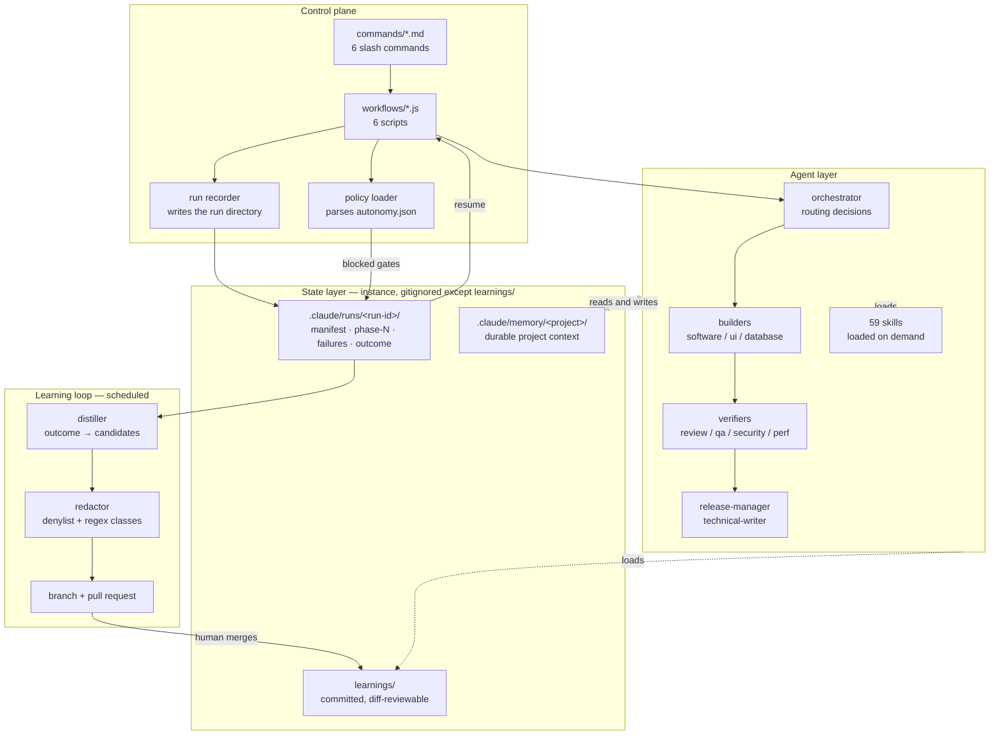

# Platform review — `agents`

> **Identifiers in this document are redacted.** The employer name, the
> author's email, and both machines' home-directory paths are replaced with
> placeholders (`<employer>`, `<author>`, `<user-home>`, `<user>`). Nothing
> analytical depends on the literal strings.
>
> This repository is public, and removing exactly those identifiers is the
> point of CHG-01, CHG-03 and CHG-04 — which this document specifies.
> Publishing the document that specifies the removal with the strings intact
> would have undone it, and `docs/` was untracked before this branch, so
> this would have been their first appearance on a remote.


**Date:** 2026-09-01
**Scope:** the whole repository except `nawi/`, `snagit-clone/` and `nawi-vex/`, which are separate projects.
**Mode:** read-only audit. The only file this review created is this one.
**Reviewed at:** commit `d5cf491` on `main`, working tree as of 2026-09-01.

---

## Executive summary

**Not safe to publish today.** No credential exists in the tree or in any of the 23 reachable commits. Three things block release. There is no licence, so nobody may reuse this. A pre-rewrite branch and a backup tag carry the author's employer email on eight commits, local-only today and one `git push --tags` from public. And real design records for a private application sit committed under the memory directory.

Maturity today:

| C1 context | C2 self-healing | C3 learning | C4 reusability | C5 release |
|---|---|---|---|---|
| 1 | 1 | 0 | 2 | FAIL |

The largest engineering risk is not a missing capability. It is **silent drift**. Skill syncing skips any file that already exists, so four ported trees are frozen at first copy. The two live workflow trees have diverged, and only one carries a bug fix. The packaged orchestrator cannot route to five agents shipped beside it. Every converter emits the line endings that already unregistered five agents once. Each failure is invisible at runtime.

Start with **Phase A**: purge those refs, untrack machine-local and private data, add a licence, and fix the two runner defects that disable worktree isolation and mis-pair pipeline results.

---

## Table of contents

- [Phase 0 — Orientation](#phase-0--orientation)
- [Operational definitions and rubric](#operational-definitions-and-rubric)
- [Phase 1 — Inventory](#phase-1--inventory)
- [Phase 2 — Assessment](#phase-2--assessment)
- [Phase 3 — Target architecture](#phase-3--target-architecture)
- [Phase 4 — Change document](#phase-4--change-document)
- [Phase 5 — Release readiness](#phase-5--release-readiness)
- [Phase 6 — Sequencing](#phase-6--sequencing)
- [Phase 7 — Open questions](#phase-7--open-questions)

---

## Phase 0 — Orientation

### What this repository is

This repository is a **source tree of prompt-defined specialist agents and the procedural knowledge they load**, plus scripts that orchestrate them, ported by hand and by converter to six agent harnesses. It holds 22 agent definitions, 59 to 65 skills depending on the tree, six orchestration scripts, and a routing policy in `CLAUDE.md` stating which agent must be invoked under which observable condition. There is no application, no library and no test suite: the definitions are the deliverable. Its organising claim, at `README.md:5`, is that the agent doing the work is never the agent certifying it, and the roster is partitioned to hold that line. Almost everything the repository calls a mechanism — memory, autonomy gates, redaction, blocked-gate escalation, the routing policy itself — is prose addressed to a model rather than code that runs. The exceptions are the JSON-schema validation the Claude Code and Command Code runtimes apply to agent return values, and three structural validators that check file shape.

### Entry points

| Harness | User types | What runs | How an agent executes |
|---|---|---|---|
| Claude Code, installed plugin | `/sdlc-suite:sdlc-feature <initiative>` | `sdlc-suite/commands/sdlc-feature.md:6-11` instructs the model to call the host `Workflow` tool with `scriptPath: "${CLAUDE_PLUGIN_ROOT}/workflows/sdlc-feature.js"` | host `agent()`, an in-process subagent |
| Claude Code, this repo | `Workflow({scriptPath: ".claude/workflows/<n>.js"})` | the `.claude/workflows/` copy. `.claude/` ships **no** `commands/` directory, so no slash command exists here | same |
| Kimi Code | `kflow sdlc "<initiative>"` | `kflow:21-40` maps the name to `.kimi-code/workflows/<n>.py` | subprocess `kimi --agent-file <suite>/agents/<n>.md -p <prompt>` (`.kimi-code/workflows/runner.py:66-90`) |
| Command Code | `node commandcode-suite/workflows/<n>.js` | that script | subprocess `cmdc -p <prompt> --permission-mode auto-accept` (`commandcode-suite/workflows/_runner.js:162-200`) |
| Copilot, Codex, `.agents/` | nothing | nothing | no runner exists in these trees |

### Unit of work

One **run**: a single workflow invocation over one input string — an initiative description, a diff or branch name, a release name, or a registry root. A run fans out to between six and roughly twenty agents across three to six phases, and terminates by returning a JSON object holding findings, a readiness recommendation and a `humanDecisionRequired` list. Runs are not identified, not persisted and not resumable.

### Runtime and framework assumed

- **Claude Code plugin format.** `sdlc-suite/.claude-plugin/plugin.json:3` declares `"version": "1.0.3"`; `.claude-plugin/marketplace.json:14` repeats it. No minimum harness version is declared anywhere.
- **Node**, for the JS workflows and the Command Code runner. No `package.json`, therefore no version floor and no dependencies.
- **Python**, for the Kimi workflows and every sync and validate script. The tracked `.kimi-code/workflows/__pycache__/*.cpython-314.pyc` implies 3.14 was used. No `requirements.txt`; `sync-all.py:29` shells out with `sys.executable`.
- **Windows**, in practice. Around 25 sites hardcode `<user-home>/…`, and `.kimi-code/workflows/runner.py:31` probes for `kimi.exe`.
- **Git**, for the worktree isolation the build phase claims.

### Where documentation and tree disagree

Every row checked against the filesystem on 2026-09-01.

| Claim | Where | Reality |
|---|---|---|
| "21 agents, 59 skills, 6 dynamic workflows" | `.claude/README.md:3` | 22 agents, 59 skills, 6 workflows |
| "agents/ 20 agent definitions", "skills/ 57 skills", "workflows/ 5 dynamic workflows" | `.claude/README.md:9-11` | 22, 59, 6 — and these three lines contradict line 3 of the same file |
| "every one of the 57 is named by at least one agent body" | `.claude/README.md:29` | there are 59 |
| "The 20 agents by lifecycle stage" | `.claude/README.md:31` | 22 |
| "`commandcode-suite/`, `.kimi-code/` and `.codex/` each carry 21 agents and are missing `orchestrator`" | `README.md:33` | all three carry 22 on disk, `orchestrator` included. Only `commandcode-suite/agents/orchestrator.md` is untracked, so the claim survives for one tree, against `HEAD` only |
| "`.codex/` ships agents (as `.toml`) with no skills" | `README.md:33` | `.codex/skills/` holds 59 `SKILL.md` on disk; they are untracked, so the claim survives against `HEAD` only |
| "Currently **15 agents** hold the `Skill` tool *and* carry the `Skills loaded` line — verified by reading … every agent file" | `sdlc-suite/README.md:50` | 17 files in `sdlc-suite/agents/` contain the phrase |
| "21 agents", three times | `commandcode-suite/README.md:3,9,59` | 22 on disk, 21 in `HEAD` |
| "Every agent reads and writes `.commandcode/memory/<project>/`" | `commandcode-suite/USAGE.md:81` | every agent file in that tree names `.claude/memory/<project>/`. The document contradicts the files it documents |
| `"commandcode-suite/skills/ (59 skills)"` printed on success | `sync-all.py:63` | 60. All eight counts that function prints are hardcoded strings, not measurements |
| "Counts above were verified by listing each directory on 2026-08-29" | `README.md:21` | true when written; three rows it vouches for are now wrong |

The pattern deserves a name, because the repository's own `CLAUDE.md` warns about it: **a count asserted in prose decays silently, and an authoritative tone is exactly what stops anyone re-checking it.** `.claude/README.md` has disagreed with itself four lines apart across at least two commits.

### The three things I am least sure about

1. **What is actually published.** `git ls-remote origin` reports `refs/heads/main` at `1f988ab`, a commit absent from this clone; the local `refs/remotes/origin/main` is stale at `d5cf491`. Auditing published history needs `git fetch`, which writes refs, so it was not run. Every history statement below concerns the local object store.
2. **Whether the plugin's namespacing works.** `sdlc-suite/USAGE.md:75-80` states plainly that intra-plugin skill resolution and MCP auth under `claude -p` are untested. Nothing in the repository settles it, and the plugin was not installed for this review.
3. **Whether the four non-Claude ports have any user.** `.commandcode/taste/taste.md` records that the author keeps parallel copies across every tool they use, at confidence 0.8. No evidence of a second user exists. Several recommendations below would change if those trees are personal scratch space rather than shipped surface.

---

## Operational definitions and rubric

The five pillars are assessed exactly as defined in the brief, not re-scoped.

| Level | Meaning |
|---|---|
| 0 | Absent. No mechanism exists. |
| 1 | Manual. Works only when a human invokes it and supplies the context. |
| 2 | Scripted. Automated for the happy path; breaks or stalls on the unhappy path. |
| 3 | Managed. Handles common failures unattended, with observability and defined escalation. |
| 4 | Self-improving. Outcomes feed back into behavior through a gated, reversible loop. |

C5 is pass or fail. One leaked credential fails it regardless of everything else.

---

## Phase 1 — Inventory

### 1.1 Agent trees

Counts taken on disk and in `HEAD` separately, because they differ.

| Tree | Format | On disk | In `HEAD` | Frontmatter keys present (of 22) | Runner |
|---|---|---|---|---|---|
| `.claude/agents/` | Markdown + YAML frontmatter | 22 | 22 | `name` 22, `description` 22, `tools` 22, `skills` 12, `model` 5 | host `Workflow` tool |
| `sdlc-suite/agents/` | Markdown + YAML frontmatter | 22 | 22 | `name` 22, `description` 22, `tools` 22, `skills` 18, `model` 5 | host `Workflow` tool |
| `commandcode-suite/agents/` | Markdown + YAML frontmatter | 22 | **21** | `name` 22, `description` 22, `tools` 22, `skills` 0, `model` 1 | `_runner.js` → `cmdc -p` |
| `.kimi-code/agents/` | Markdown + YAML frontmatter | 22 | 22 | `name`, `description`, `whenToUse`, `tools` 22 each; `subagents` 5 | `runner.py` → `kimi -p` |
| `.copilot/agents/` | JSON | 22 | 22 | `name`, `description`, `whenToUse`, `tools`, `body` 22 each; `subagents` 5 | none |
| `.codex/agents/` | TOML | 22 | 22 | `name`, `description`, `developer_instructions` 22 each | none |

`commandcode-suite/agents/orchestrator.md` is present on disk and untracked; 17 other files in that tree are modified against `HEAD`. Nothing in `.gitignore` explains either, so this is uncommitted work rather than deliberate exclusion.

**No agent file in any of the six trees carries a `version` field.** Searched `^version:`, `"version"`, `^version *=`.

**Nine of 22 descriptions carry an `INVOKE WHEN:` clause**, the same nine in every tree: `code-reviewer`, `database-engineer`, `orchestrator`, `qa-engineer`, `qa-runner`, `security-engineer`, `solution-architect`, `technical-writer`, `ux-designer`.

### 1.2 The 22 agents, with grants

Identical name set in all six trees. Tool grants read from `.claude/agents/*.md` frontmatter.

| Agent | Lines | Write | Edit | Bash | Web | Delegates to | `skills:` | `model:` |
|---|---|---|---|---|---|---|---|---|
| `boundary-prober` | 102 | ✓ | | ✓ | | | integrity, memory | inherit |
| `code-reviewer` | 246 | | | ✓ | | | — | — |
| `database-engineer` | 239 | ✓ | ✓ | ✓ | | `qa-runner` | — | — |
| `incident-commander` | 237 | ✓ | | ✓ | | | — | — |
| `journey-orchestrator` | 92 | ✓ | | ✓ | | `persona-runner` | integrity, memory | inherit |
| `orchestrator` | 225 | | | ✓ | | all 22 specialists | — | — |
| `performance-engineer` | 226 | ✓ | | ✓ | | `qa-runner` | — | — |
| `persona-discovery` | 125 | ✓ | | | | | integrity, memory | inherit |
| `persona-runner` | 118 | ✓ | | ✓ | | | integrity, memory | inherit |
| `product-analyst` | 236 | ✓ | | | | | — | — |
| `product-archaeologist` | 183 | ✓ | | ✓ | | | integrity, memory, capability-extraction, prd-synthesis | — |
| `product-manager` | 208 | ✓ | | | | | — | — |
| `qa-engineer` | 463 | ✓ | ✓ | ✓ | | `qa-runner`, `persona-runner` | — | — |
| `qa-runner` | 100 | | | ✓ | | | — | `sonnet` |
| `release-manager` | 204 | ✓ | | ✓ | | | — | — |
| `security-engineer` | 169 | ✓ | ✓ | ✓ | ✓ | | integrity, memory | — |
| `site-reliability` | 197 | ✓ | | ✓ | | | integrity, memory | — |
| `software-engineer` | 313 | ✓ | ✓ | ✓ | | | integrity, memory | — |
| `solution-architect` | 225 | ✓ | ✓ | ✓ | ✓ | | integrity, memory | — |
| `technical-writer` | 176 | ✓ | ✓ | | | | integrity, memory | — |
| `ui-engineer` | 192 | ✓ | ✓ | ✓ | | | integrity, memory | — |
| `ux-designer` | 204 | ✓ | | | | | integrity, memory | — |

Nineteen of 22 hold `Write`. Eight hold `Edit`. Sixteen hold `Bash`. Two hold `WebSearch`/`WebFetch`.

Eight agents grant a tool named `TaskCreate` — `incident-commander`, `product-analyst`, `product-manager`, `qa-engineer`, `release-manager`, `software-engineer`, `solution-architect`, `ui-engineer`. **No agent body anywhere in any tree contains a procedure that uses it.** The only non-frontmatter occurrence in the whole repository is `.claude/audit/findings.json:13-14`, where a prior audit raised the concern and dissolved it: *"Not a finding. TaskCreate is documented and valid. The 7 agents declaring it are correct."* There are now eight, not seven, and the grant is still exercised by nothing — which is a direct violation of the repository's own invariant at `.claude/README.md:200` ("every tool in `tools:` must be exercised by a procedure in the body"), the same class as the single BLOCKER the original audit found.

### 1.3 Skill trees

| Tree | Skill dirs on disk | `SKILL.md` in `HEAD` | Frontmatter keys | Notes |
|---|---|---|---|---|
| `.claude/skills/` | 59 | 59 | `name`, `description` | no `autonomy-policy` |
| `sdlc-suite/skills/` | 60 | 60 | `name`, `description` | the shipped set |
| `commandcode-suite/skills/` | 60 | 60 | `name`, `description` | |
| `.kimi-code/skills/` | 65 | 65 | `name`, `description`, `type` on 6 | the 6 extras are the workflows packaged as `type: flow` skills |
| `.copilot/skills/` | 59 | 59 | `name`, `description` | |
| `.codex/skills/` | 59 | **0** | `name`, `description` | entire tree untracked, unexplained by `.gitignore` |
| `.agents/skills/` | 59 | 59 | `name`, `description` | skills only; no `agents/` directory, and no script generates it |

**No `SKILL.md` in any tree carries a `version` field.** Searched `^version:` across all seven trees.

Set deltas against `.claude/skills` as baseline: `.agents`, `.copilot`, `.codex` identical; `sdlc-suite` and `commandcode-suite` add `autonomy-policy`; `.kimi-code` adds `independent-review`, `persona-qa-sweep`, `registry-audit`, `release-readiness`, `sdlc-feature`, `system-archaeology`.

Every skill directory also carries the same non-`SKILL.md` file in all seven trees: `skills/exploration-charter/personas-schema-template.yaml`.

**Skill wiring is sound and should not be touched.** All 59 skills in `.claude/skills/` are named by at least one agent body, so the orphan count is zero and the registry invariant at `.claude/README.md:203` holds. The mechanism that made it stick is worth naming: `sdlc-suite/README.md:47-49` records that granting the `Skill` tool was necessary and insufficient, and that only moving the requirement into the output contract — a mandatory `Skills loaded` line in the report — made agents actually load them.

### 1.4 Commands, settings, hooks, MCP

| Artifact | Path | Contents |
|---|---|---|
| Slash commands | `sdlc-suite/commands/*.md` (6) | frontmatter `description`, `argument-hint`; body instructs the model to call `Workflow` with `scriptPath: "${CLAUDE_PLUGIN_ROOT}/workflows/<n>.js"` (`sdlc-feature.md:6-11`) and to pass `policy: "${CLAUDE_PLUGIN_ROOT}/autonomy.json"` (`:15`) |
| Slash commands | `commandcode-suite/commands/*.md` (6) | same shape, but each hardcodes an absolute machine path at lines 9 and 14 |
| Slash commands | `.claude/commands/` | **NOT FOUND** — the live tree ships no commands, so in this repository a workflow must be invoked by calling `Workflow` with an explicit `scriptPath` |
| Plugin manifest | `sdlc-suite/.claude-plugin/plugin.json` | `name`, `version: "1.0.3"`, `description`, `author.name`, `keywords`. No harness version floor, no dependency declaration |
| Marketplace | `.claude-plugin/marketplace.json` | one plugin, `source: "./sdlc-suite"`, `version: "1.0.3"` duplicated from the manifest |
| Autonomy policy | `sdlc-suite/autonomy.json`, `commandcode-suite/autonomy.json` | byte-size-identical copies. `mode`, `preAuthorized.decide` (6 gates, 5 on), `preAuthorized.act` (8 gates, all off), `onBlocked: "record-and-continue"`, `escalation.channel: "return"` |
| Machine settings | `.commandcode/settings.json` | **tracked.** `permissions.allow` with 33 entries, `deny: []`, `defaultMode: "default"` |
| Machine settings | `.claude/settings.local.json` | present on disk, **not** tracked — `.gitignore:36-37` matches it |
| Preference store | `.commandcode/taste/taste.md` | tracked. Two confidence-scored bullets about the author's tooling preferences |
| Hooks | anywhere | **NOT FOUND** — searched `PreToolUse`, `PostToolUse`, `SessionStart`, `"hooks"`, `hooks:`. The only occurrences are descriptive text in `.claude/audit/findings.json:179-183` and `.claude/audit/AUDIT.md:174`, both about a user-global file outside this repository |
| MCP | `.mcp.json` | **NOT FOUND.** The only server reference is `"enabledMcpjsonServers": ["webmcp"]` in the untracked `.claude/settings.local.json`. `sdlc-suite/USAGE.md:72` warns that Atlassian/ADO and Confluence servers may be absent headless, but no workflow references any MCP tool |

### 1.5 Orchestration: what calls what

```
human types a slash command or calls Workflow
   │
   ▼
command .md  ──tells the model to call──▶  Workflow tool  ──executes──▶  workflow script
                                                                             │
                    ┌────────────────────────────────────────────────────────┤
                    ▼                                                        ▼
              phase('Requirements')                                   agent(prompt, opts)
              product-analyst ──returns CRITERIA_SCHEMA──┐                   │
                    │                                    │            in-process subagent
                    ▼                                    │            reads agent .md
              phase('Design')  ux-designer ∥ solution-architect               from the tree
                    │
                    ▼
              phase('Build')   software-engineer ∥ ui-engineer ∥ database-engineer
                    │                     (isolation: 'worktree')
                    ▼
              phase('Verify')  code-reviewer ∥ qa-engineer ∥ security-engineer ∥ performance-engineer
                    │                each piped straight into ──▶ phase('Cross-check') refuter
                    ▼
              phase('Readiness') release-manager ∥ technical-writer
                    │
                    ▼
              return { …, humanDecisionRequired: [...], blockedGates: "<a string instruction>" }
                    │
                    ▼
              the model relays it to the human    ◀── the ONLY escalation channel
```

Where the answer is "a human":

| Decision | Who decides today |
|---|---|
| Which workflow runs at all | a human types the command |
| Whether an initiative is worth building | a human. `product-manager` is deliberately outside `sdlc-feature`, per `.claude/README.md:170` |
| Go/no-go on release | a human. `release-manager` returns a recommendation (`sdlc-feature.js:251`) |
| Every `preAuthorized.act.*` gate | a human, all eight default off |
| Whether a blocked gate is noticed | a human reading the returned text; there is no other channel |
| Whether a run resumes after interruption | a human re-runs it from the beginning |
| Whether the ports are in sync | a human, and no check exists |

`orchestrator` is the one agent whose job is routing, and it is reached only when a human invokes it. `qa-runner` appears in no workflow script and is reached only at runtime via `Agent(qa-runner)` from three agents — `.claude/README.md:178` states this is deliberate.

### 1.6 All state

| Path | Written by | Read by | Lifetime |
|---|---|---|---|
| `.claude/memory/<project>/` | nothing in code. Eleven of 22 agent bodies are instructed to write here | the same eleven agent bodies, by instruction | permanent, and empty except two real files |
| `.claude/memory/README.md` | human | prose only | permanent |
| `.claude/memory/snagit-clone/` (2 files) | an agent run against a private project | nothing | permanent, tracked |
| `sdlc-suite/memory-template/` (20 entries) | human | **nothing reads or copies it programmatically.** `sdlc-suite/USAGE.md:73` tells a human to copy it by hand | permanent |
| `commandcode-suite/memory-template/` | human | nothing | permanent, duplicate of the above |
| `.kimi-code/memory/README.md` | human | nothing. The directory exists only to say it is not the memory root | permanent |
| `.claude/audit/` (7 files) | a prior audit | **no code reader.** Referenced in prose at `.claude/README.md:209`, `README.md:19`, and in two workflow `whenToUse` strings | permanent, tracked, describes a 15-agent / 51-skill registry dated 2026-08-04 |
| `.kimi-code/workflows/__pycache__/` (7 `.pyc`) | the Python interpreter | nothing | tracked in git |
| workflow run state | nothing | nothing | **the process.** No run id, no run directory, no log file |

Three of these are dead weight by the brief's definition — state nothing reads. `memory-template/` exists in two identical copies that no code touches. `.claude/audit/` has no code reader. `__pycache__` is build output.

The memory tree deserves one more note, because it is the only substrate a learning loop could build on. The declared schema at `.claude/skills/project-memory/SKILL.md:14-32` is 13 flat files plus 6 subdirectories with a named owning agent each. The seed files are one-line stubs; `sdlc-suite/memory-template/lessons-learned.md` in full is:

```markdown
# lessons-learned

_Empty. Owned per the `project-memory` skill. Add dated, factual entries at the natural checkpoint — never anything that would justify skipping a future check._
```

An agent appending to that file produces an append-only blob, not one concept per file. The two real memory files under `.claude/memory/snagit-clone/` are the only worked examples, and they are the right shape — dated, single-concern, with a stated owner and a supersession rule (`ADR-0001-video-export-pipeline.md:3-7`). Nothing enforces that shape.

### 1.7 All external surfaces

| Surface | Where | Status for a new adopter |
|---|---|---|
| Claude Code CLI and `Workflow` tool | `sdlc-suite/commands/*.md`, all JS workflows | **obtainable** |
| `kimi` CLI | `.kimi-code/workflows/runner.py:22-37`, resolved from `$KIMI_BIN`, then `~/.kimi-code/bin/kimi.exe`, then `PATH` | obtainable; Windows-shaped default |
| `cmdc` CLI | `commandcode-suite/workflows/_runner.js:43-50` | obtainable |
| `node`, `python`, `git` | throughout | obtainable; no version declared anywhere |
| MCP servers | none referenced by any runtime; warned about in `sdlc-suite/USAGE.md:72` | not required |
| Network | the only URLs in the tree are `http://localhost:3000`, `http://localhost:8080` as example targets, and one documentation link to the Kimi CLI docs | **no private endpoint** |
| Credentials | none read by any script. No `.env`, no key file, no token | **none required** |
| Four external skills | `qa-tooling/SKILL.md:33` names `playwright-best-practices`, `playwright-cli`, `mabl-plan-test`, `mabl-debug` | **correctly handled.** `:40` marks them environment-dependent, says to check whether they resolve, and forbids treating absence as a reason to skip the capability, with stack-neutral alternatives given for every row |

This is the pillar the repository is strongest on. Nothing here depends on a private endpoint, an internal MCP server, or a credential a new adopter cannot obtain.

### 1.8 Duplication and drift

Files containing each shared block, out of 22 agents per tree:

| Tree | `Skills loaded` | `Supporting Skills` | Source it is generated from | `autonomy-policy` wired |
|---|---|---|---|---|
| `.claude/agents` | 21 | 19 | hand-edited | 0 |
| `.kimi-code/agents` | 21 | 19 | `.claude` (`sync-skills.py:8`, `convert-agents.py`) | 0 |
| `.copilot/agents` | 21 | 19 | `.claude` | 0 |
| `.codex/agents` | 21 | 19 | `.claude` | 0 |
| `sdlc-suite/agents` | **17** | **14** | hand-edited | **10** |
| `commandcode-suite/agents` | **17** | **14** | `sdlc-suite/agents` (`convert-agents.py:8`) | **10** |

This is the whole drift story in one table. There are **two generations**, not six copies. `sdlc-suite/` and its derivative `commandcode-suite/` are one; `.claude/` and its three derivatives are the other. The generations differ in both directions:

- `sdlc-suite/` is **ahead** on autonomy: ten agents wired to `autonomy-policy`, a skill that does not exist in `.claude/skills/` at all. The ten match exactly the ten agents `sdlc-suite/USAGE.md:46` says carry stop-and-confirm gates, so that wiring is complete and correct within its own tree.
- `sdlc-suite/` is **behind** on the output contract: four fewer agents carry the `Skills loaded` line and five fewer carry `Supporting Skills`. The namespace rewrite does not explain it, because neither phrase is namespaced.
- `sdlc-suite/agents/orchestrator.md:4` drops the `Agent()` grants for `incident-commander`, `persona-discovery`, `persona-runner`, `boundary-prober` and `journey-orchestrator`, and deletes their routing-table rows and the 12-line escalation block that `.claude/agents/orchestrator.md:91-95,118-129` carries. The packaged orchestrator cannot route to five agents that ship in the same directory.
- `sdlc-suite/workflows/registry-audit.js:12-19` carries an args-parsing fix, with a comment naming the exact bug, that `.claude/workflows/registry-audit.js:12` does not have.
- `.claude/workflows/` contains **no** autonomy wiring at all: searched `blockedGates`, `autonomy`, `policy` across all six files, zero hits. `sdlc-suite/workflows/sdlc-feature.js:226,254-258` has it.
- All four converters write in Python's default text mode, so on Windows every generated definition lands with CRLF: `.kimi-code/convert-agents.py:125`, `commandcode-suite/convert-agents.py:134`, `.copilot/convert-agents.py:122`, `.codex/convert-agents.py:63`. `git ls-files --eol -- '*.md'` reports 45 files as `w/crlf` against 467 `w/lf`, with the index clean at `i/lf` for all 512 — 22 of 22 `.kimi-code/agents/`, 22 of 22 `commandcode-suite/agents/`, `sdlc-suite/README.md` and `sdlc-suite/skills/engineering-integrity/SKILL.md`. `CLAUDE.md:141-149` records that CRLF in frontmatter silently unregistered five agents once and that `.gitattributes` was added to prevent it; the pin governs what git writes, not what a converter writes, and the runners read the on-disk copy. See CHG-26.

Contradictory instructions found:

| # | Where | The contradiction |
|---|---|---|
| 1 | `sdlc-suite/agents/qa-engineer.md` ~`:339` against `.claude/agents/qa-engineer.md` ~`:337` | At the same gate, the packaged copy says do not halt under an unattended run and consult `autonomy.json`; the live copy has no such carve-out. Two live trees give opposite instructions at the same gate |
| 2 | `commandcode-suite/USAGE.md:81` against all 22 files in `commandcode-suite/agents/` | The document says the memory root is `.commandcode/memory/<project>/`. Eleven agents name `.claude/memory/<project>/` and **zero** name `.commandcode/memory` |
| 3 | `.claude/README.md:3` against `.claude/README.md:9-11` | 21 agents / 59 skills against 20 agents / 57 skills / 5 workflows, four lines apart |
| 4 | `sdlc-suite/skills/autonomy-policy/SKILL.md:16` against `sdlc-suite/agents/qa-engineer.md` | The skill resolves the policy from a workflow-supplied path then `.claude/autonomy.json`, and explicitly warns that `${CLAUDE_PLUGIN_ROOT}` does not expand in skill text. The agent body just says "in `autonomy.json`" without saying which |
| 5 | `sdlc-suite/commands/*.md:9` against `commandcode-suite/commands/*.md:9` | The same six commands: one resolves through `${CLAUDE_PLUGIN_ROOT}`, the other hardcodes one machine's home directory |
| 6 | `.claude/skills/engineering-integrity/SKILL.md:8` | Declares that where the skill and an agent's own spec differ, the agent's spec wins. No agent restates it, so the precedence rule lives only on one side of the relationship it governs |

---

## Phase 2 — Assessment

### C1 — Self-managing context: **level 1**, target **3**

| Criterion | Present | Evidence |
|---|---|---|
| Retrieval scoped and on demand | **no** | `sdlc-suite/workflows/sdlc-feature.js:145` concatenates every builder's full output into `implementation`, and `:183` pastes that entire blob into all four verify lenses. Each surviving finding then goes to a refuter with the criteria re-attached (`:192`). Context grows multiplicatively: three builders into four lenses into N refuters, with no excerpting, no file-list handoff and no summarisation stage |
| Long runs survive compaction | **no** | No workflow in any tree writes a file. Searched `writeFile`, `write_file`, `open(` across `.claude/workflows`, `sdlc-suite/workflows`, `.kimi-code/workflows/*.py`, `commandcode-suite/workflows`: zero hits. The Python runner *defines* helpers at `.kimi-code/workflows/runner.py:196` and `:201`; `write_file` is imported once at `system-archaeology.py:21` and **never called**, and `read_file` is never even imported |
| Artifact handoff with a stable schema | **partly, and unevenly** | Claude Code and Command Code enforce real JSON Schemas — `sdlc-feature.js:21-41` and `:43-64`, validated by the host; Command Code re-implements the check itself at `_runner.js:216-233`. The Kimi port has **no** schema parameter (`runner.py:51-56`); it appends prose hints (`sdlc-feature.py:25-45`) and regex-scrapes the reply, ending in a greedy `re.search(r"\{.*\}", text, re.DOTALL)` at `runner.py:181`. The same six workflows validate structure on one platform and guess at it on another |
| Sessions resume after interruption | **no** | Searched `resume`, `checkpoint`, `resumeFromRunId`: zero hits in any workflow tree. There is no run id and no partial-state file. A failure in phase 4 of 5 discards phases 1 through 3 |
| A context budget per role, enforced | **no** | Searched `budget`, `max_tokens`, `maxTokens`, `contextWindow`: the only `budget` hits are the phrase "error budget" in prose at `release-readiness.js:51` and its three ports. The nearest analogues bound *turns*, not tokens: `effort: 'low'` at `sdlc-feature.js:197` and `--max-turns 200` at `_runner.js:192` |

What already works and must not be replaced: the schemas themselves, the refutation pipeline that sends each finding to a different evidentiary lens (`sdlc-feature.js:186-207`), and the choice to pipeline rather than barrier so a slow lens does not hold up a fast one.

Target 3 rather than 4 because level 4 for this pillar would mean context management that learns its own budgets, and nothing in how this repository is used justifies that. Level 3 means a run survives interruption, hands off by reference rather than by value, and has an enforced ceiling per role.

### C2 — Self-healing: **level 1**, target **3**

| Criterion | Present | Evidence |
|---|---|---|
| Failure classes named and distinguished | **no** | `.kimi-code/workflows/runner.py:92-98` collapses a non-zero exit, a `TimeoutExpired` and a bare `Exception` into one `AgentResult(success=False, error=<str>)`. Callers can test only `.success`. "Agent file not found" (`:64`), "CLI missing", "timed out" and "the model refused" are indistinguishable downstream |
| Retries bounded, strategy changes | **one platform only** | `commandcode-suite/workflows/_runner.js:162` sets `retries = 3`; the loop at `:198-234` rewrites the prompt with the specific failure reason, so the strategy genuinely changes. But it retries **only** schema-conformance failures: `:201-204` returns `null` immediately when the process exits non-zero *and* produced no output. No backoff, no jitter. The Claude Code and Kimi runtimes have **no retry at all** — searched `retry`, `retries`, `attempt`, `backoff` in `.claude/workflows`, `sdlc-suite/workflows`, `.kimi-code/workflows`: zero hits |
| Operations idempotent or guarded | **trivially, and that is the problem** | No workflow persists anything, so re-running clobbers nothing. Zero resumability is the same fact stated from the other side |
| Circuit breaker with a defined trigger and escalation | **no** | Searched `circuit`, `fallback`, `escalat` across all workflow trees: prose only |
| Failures recorded machine-readably | **no** | `runner.py:152` prints to `sys.stderr`. `_runner.js:29` and `:33` print to **stdout** via `console.log`, and `commandcode-suite/workflows/sdlc-feature.js:244` prints the JSON report to stdout too — so `commandcode-suite/commands/sdlc-feature.md:12`, which tells a consumer the script "prints a final JSON report on stdout", describes a stream that also carries `[workflow] …` and `=== PHASE: … ===` lines. Piping that output to a parser fails |

Two defects found that silently disable features believed to work:

1. **`pipeline()` mis-pairs results with items.** `.kimi-code/workflows/runner.py:105` and `:113` return results in *completion* order via `as_completed`; `:141` then does `zip(stage_results, items)`. Under any timing skew the `code-reviewer` lens's findings get cross-checked as though they were the `security-engineer`'s, and every per-item label is wrong. The docstring at `:105` states the completion-order behavior that `:141` assumes away.
2. **`withWorktree` runs git through the wrong binary.** `commandcode-suite/workflows/_runner.js:262`, `:269` and `:279` call `runCmdc(['rev-parse', …])`, `runCmdc(['worktree','add',…])` and `runCmdc(['worktree','remove',…])`, but `runCmdc` at `:74-82` spawns the `cmdc` LLM CLI, not `git`. The repo check can therefore never succeed, every build falls through to the "not a git repo" path at `:265-266`, and the isolation the design claims is never engaged. The Python suite has no isolation mechanism at all: `grep -rniE 'worktree|isolation' .kimi-code/workflows/*.py` returns one hit, and it is prose about persona session keys.

What already works: the fail-closed defaults. A gate agent returning nothing is `Missing`, never "probably fine"; a refuter returning no verdict leaves the finding unconfirmed (`sdlc-feature.js:204`, `refuted: v?.refuted !== false`). The explicit stop conditions at `:79-85` and `:146-148` return a structured `{status:'stopped', reason}` rather than proceeding on inference.

Target 3, not 4. Level 4 here would mean the system tunes its own retry policy from history, which is not worth building for a repository whose runs are measured in dozens per month.

### C3 — Learning without being asked: **level 0**, target **4**

Level 0 is the honest score. Every component of this pillar is absent, not partial.

| Criterion | Present | Evidence |
|---|---|---|
| Run outcomes in a structured machine-readable store | **no** | No workflow writes anything. Five of the six never mention memory at all; the sixth mentions `.claude/memory/<project>/requirements/` only inside a prompt string (`system-archaeology.js:89`). Findings, refutation verdicts, blocked gates, durations — all discarded at `return` |
| Something distils outcomes unprompted | **no** | Searched `distill`, `promote`, `playbook`, `lessons`, `retro` across all workflow trees. The `promote` hits are persona-promotion prose at `persona-qa-sweep.js:52,228` |
| A schedule or trigger | **no** | No `.github/` exists. `sdlc-suite/USAGE.md:63` *recommends* the `schedule` skill or `CronCreate` for recurring runs, which is a documentation pointer, not a wired trigger |
| Redaction before promotion | **no** | The only redaction anywhere is the word REDACT inside a prompt: `sdlc-suite/workflows/registry-audit.js:74` asks the model to "report location, REDACT the value". Searched `denylist`, `scrub`, `sanitiz`: zero hits. No output passes through any filter; agent text is concatenated raw into the next prompt at `sdlc-feature.js:145` |
| Promotion is a pull request | **no, and deliberately so** | Searched `gh pr`, `pull request`, `git push`, `git commit`: zero hits. The posture is correct and consistent with `sdlc-feature.js:251` ("release-manager recommends, it never commits") — but it means the loop has no output channel other than terminal text |
| Diff-reviewable artifacts | **not applicable yet** | The declared memory files are append-target stubs (`sdlc-suite/memory-template/lessons-learned.md`), which would accrete into a blob. The two real files under `.claude/memory/snagit-clone/` are the right shape — dated, single-concern, with an explicit supersession rule at `ADR-0001-video-export-pipeline.md:3-7` — but nothing enforces it |
| Attribution and reversibility | **no** | No provenance mechanism exists |
| Decay or review policy | **no** | `.claude/README.md:191` describes the highest-value thing to store as "outcome tracking on hypotheses — did the architectural bet hold". Nothing implements it |

The design intent must be stated honestly: with a pull-request gate, **the system proposes unprompted and a human ratifies.** That is the target, and it is worth naming as target 4 because it is the one pillar where the repository's whole reason for existing — accumulated hard-won lessons — is currently transmitted by the author hand-editing prose. `README.md:35` says the examples are load-bearing because they came from real failures. Every one of those got into the agent files by a human writing them down. That is the loop to close.

### C4 — Reusability: **level 2**, target **3**

| Criterion | Present | Evidence |
|---|---|---|
| Hard platform/instance separation | **conceptually yes, in practice broken at one critical point** | The runtime boundary is genuinely sound: `.kimi-code/workflows/runner.py:16-19` resolves the suite from `__file__` and runs agents with `cwd=Path.cwd()` (`:87-89`), `kflow:39` deliberately does not `cd`, and `_runner.js:20-21` follows the same pattern. `${CLAUDE_PLUGIN_ROOT}` does the same job for the plugin. **But `CLAUDE.md` — which `README.md:15` calls "The routing policy. Read this first." and which `README.md:7` identifies as the answer to the suite's founding problem — exists only at the repository root and is not in `sdlc-suite/`.** `sdlc-suite/README.md:9` concedes it: the routing policy lives in "the source repository's root `CLAUDE.md`". An adopter who installs the plugin gets 22 agents, 60 skills and 6 commands, and none of the mechanism the repository says makes them fire |
| An initialization path | **manual, documented only** | `sdlc-suite/USAGE.md:5-11` gives two install commands. The three pre-flight steps at `:69-73` — widen the permission allowlist, verify MCP auth, copy `memory-template/` to `.claude/memory/<project>/` — are all manual, and the document itself concedes at `:73` that if the memory root is missing "nobody is watching the write fail". Searched for an init script: none exists in any tree |
| Config declared, documented, validated | **documented, never validated** | `autonomy.json` is well documented (`USAGE.md:52-57`, `autonomy.json:2`) and **read by no code at all.** Resolution is delegated to the model in prose at `autonomy-policy/SKILL.md:16`. No validator in any tree reads it, so `preAuthorized.act.deploi` is silently treated as absent. Since absent means not authorized, a typo fails safe on the deploy gates and fails *closed* on the five `decide` gates that are meant to be on — a run would silently start blocking roadmap and prioritization decisions it was authorized to make |
| Agents and skills versioned, with a compatibility policy | **no** | No `version` field on any of the 22 agents or 59-65 skills in any of the seven trees. The only version is the plugin's, duplicated by hand in two files that `USAGE.md:15` says must both be bumped. A consumer cannot tell which revision of the 463-line `qa-engineer` they have |
| Definitions survive generation intact | **no** | All four converters emit CRLF on Windows (§1.8), reproducing the exact frontmatter shape `CLAUDE.md:141-149` says unregistered five agents. 45 tracked `.md` files are `w/crlf` on disk while the index is uniformly `i/lf`, so every git-based check passes. CHG-26 |
| No dependency on anything private | **clean** | See §1.7. No private endpoint, no internal MCP server, no credential. The four external skills at `qa-tooling/SKILL.md:33` are correctly marked environment-dependent at `:40` with stack-neutral alternatives |

The finding that dominates this pillar is not in the table, because it is a mechanism defect rather than a missing feature: **cross-harness sync cannot propagate an edit.** `.kimi-code/sync-skills.py:22-24`, `.copilot/sync-skills.py:22-24`, `.codex/sync-skills.py:22-24` and `commandcode-suite/sync-skills.py:22-24` are byte-for-byte the same three lines:

```python
        if dst.exists():
            skipped += 1
            continue
```

A skill edited in `.claude/skills/` is copied on first run and never again. `sync-all.py:52-63` then prints `[OK] All syncs completed successfully!` followed by eight hardcoded counts, one of which (`:63`) is already wrong. Four downstream trees are frozen at whenever each skill was first copied, and the tool that maintains them reports success.

Target 3, not 4. Level 4 for reusability would mean the platform adapts itself to a new repository, and the honest ceiling here is a validated init path plus versioning.

### C5 — Public release readiness: **FAIL**

Detailed in [Phase 5](#phase-5--release-readiness). The summary: no credential exists in the tree or in any of the 23 reachable commits, and the four blocking items are a missing licence, the employer identity preserved on eight commits under local-only refs, private-project design records committed under `.claude/memory/`, and machine-local configuration tracked because the ignore rules do not match its filename.

### Summary

| Pillar | Current | Target | Why not higher |
|---|---|---|---|
| C1 self-managing context | 1 | 3 | Level 4 would mean self-tuning budgets; unjustified at this usage |
| C2 self-healing | 1 | 3 | Level 4 would mean learned retry policy; unjustified at this usage |
| C3 learning | 0 | 4 | This is the pillar the repository exists to serve, and the only one where 4 is right — as propose-and-ratify, never auto-merge |
| C4 reusability | 2 | 3 | Level 4 would mean self-adapting install; a validated init path is the honest ceiling |
| C5 release readiness | FAIL | PASS | Pass or fail only |

---

## Phase 3 — Target architecture

The design goal is narrow: keep every part of the agent layer that works, and give it a state layer so that context, failure and outcome stop living in a terminal buffer. One change — a run directory — supplies C1 resume, C2 failure records and C3 a store to distil from.

### Components



Four rules the diagram encodes:

1. **The control plane owns state, not the agents.** Agents already write files; what they do not do is record the run. A workflow script is the only thing that knows a run happened, so the recorder belongs there.
2. **`learnings/` is the only state-layer directory that is committed.** `runs/` is transient and gitignored. That is what makes the pull-request gate meaningful.
3. **The policy loader is code.** Today `autonomy.json` is interpreted by a model reading prose. A gate table parsed in JavaScript and injected into the prompt is checkable; a file the model is asked to find is not.
4. **Nothing in the loop can reach the default branch.** The distiller writes a branch and opens a pull request. Merge is the ratification.

### Directory layout after the change

```
agents/                                    ═══ PLATFORM (generic, shippable) ═══
├── LICENSE                                new
├── SECURITY.md  CONTRIBUTING.md  NOTICE   new
├── CHANGELOG.md                           new — the compatibility record
├── .github/
│   ├── workflows/ci.yml                   new — validators + gitleaks, runs on a fork
│   ├── workflows/distil.yml               new — scheduled learning loop
│   ├── ISSUE_TEMPLATE/  PULL_REQUEST_TEMPLATE.md
├── sdlc-suite/                            THE PLATFORM. Canonical source of truth.
│   ├── .claude-plugin/plugin.json         the single version source
│   ├── ROUTING.md                         new — the generic half of today's CLAUDE.md
│   ├── autonomy.schema.json               new — validates the policy file
│   ├── autonomy.json                      the default policy (all `act` gates off)
│   ├── agents/          22, each with `version:`
│   ├── skills/          60, each with `version:`
│   ├── commands/        6
│   ├── workflows/       6 + _state.js (run recorder)
│   ├── memory-template/ 20 entries, copied by `init`
│   └── tools/
│       ├── init.mjs                       new — scaffolds an instance
│       ├── validate.py                    moved here; the shipped tree gets checked
│       ├── generate-trees.py              replaces the four sync scripts
│       ├── distil.py                      new
│       └── redact.py                      new
├── .claude/                               GENERATED from sdlc-suite. Never hand-edited.
├── .kimi-code/  .codex/  .copilot/  .agents/   GENERATED. See Phase 6 on demoting these.
├── CLAUDE.md                              instance config for THIS repo only
└── docs/
    └── platform-review-2026-09-01.md

<consuming repo>/                          ═══ INSTANCE (per adopter) ═══
└── .claude/
    ├── CLAUDE.md            ← generated by `init` from sdlc-suite/ROUTING.md + local answers
    ├── autonomy.json        ← copied by `init`, validated against the schema
    ├── memory/<project>/    ← scaffolded by `init` from memory-template
    ├── runs/<run-id>/       ← written per run. gitignored
    └── learnings/           ← committed. The only thing the loop can add to
```

**The platform/instance boundary is the `sdlc-suite/` directory.** Everything inside it is generic and shippable. Everything an adopter must supply lives in their own `.claude/`, is produced by `init`, and is validated. The specific defect this fixes: today the routing policy is on the wrong side of that line, and the four repository-layout paragraphs at `CLAUDE.md:128-154` are instance configuration sitting in a file the README presents as the platform's core.

### Contracts

Five interfaces, each with the schema of what crosses it.

**1. Run manifest** — `.claude/runs/<run-id>/manifest.json`, written once at run start, updated at each phase boundary.

```json
{
  "runId": "20260902T141500Z-sdlc-feature-a3f1",
  "workflow": "sdlc-feature",
  "workflowVersion": "1.1.0",
  "platformVersion": "1.1.0",
  "args": "Add CSV export to the reporting dashboard",
  "startedAt": "2026-09-02T14:15:00Z",
  "phases": [
    { "title": "Requirements", "status": "complete", "artifact": "phase-1-requirements.json" },
    { "title": "Design",       "status": "complete", "artifact": "phase-2-design.json" },
    { "title": "Build",        "status": "failed",   "artifact": "phase-3-build.json" }
  ],
  "resumableFrom": "Build",
  "agentVersions": { "product-analyst": "1.0.3", "ux-designer": "1.0.3" }
}
```

`resumableFrom` is the whole point: it names the first phase that must re-run. `agentVersions` is what makes a stale learning detectable later.

**2. Phase artifact** — `phase-<n>-<title>.json`. The existing per-agent schemas move here unchanged; nothing about `CRITERIA_SCHEMA` or `FINDINGS_SCHEMA` needs to change.

```json
{
  "phase": "Verify",
  "completedAt": "2026-09-02T14:31:07Z",
  "agents": [
    { "label": "verify:qa", "agentType": "qa-engineer", "status": "ok",
      "result": { "verdict": "…", "findings": [ … ] },
      "handoff": { "files": ["src/export.ts"], "diffRef": "HEAD~1..HEAD", "chars": 4120 } }
  ]
}
```

`handoff` is the C1 fix. Downstream lenses receive `files` and `diffRef` and go read what they need, instead of receiving the concatenated text of everything upstream.

**3. Failure record** — `failures.jsonl`, one JSON object per line, append-only.

```json
{"at":"2026-09-02T14:22:03Z","label":"build:frontend","agentType":"ui-engineer","class":"tool","attempt":2,"of":3,"detail":"cmdc exited 127","strategyNext":"fall back to inline execution","breakerCount":1}
```

`class` is one of `transient`, `tool`, `auth`, `bad-input`, `logic`, `env-drift`. The taxonomy is the C2 fix: `auth` is never retried, `transient` is retried with backoff, `bad-input` is retried with a rewritten prompt exactly as `_runner.js:198-234` already does for schema failures, and `logic` stops the phase.

**4. Outcome record** — `outcome.json`, written once at run end. This is the store the distiller reads.

```json
{
  "runId": "20260902T141500Z-sdlc-feature-a3f1",
  "status": "completed",
  "findings": { "confirmed": 3, "refuted": 7,
                "byLens": { "review": 2, "qa": 1, "security": 0, "performance": 0 } },
  "refutations": [
    { "lens": "review", "severity": "high", "summary": "…", "refuted": true,
      "why": "the guard at src/a.ts:40 already covers this" }
  ],
  "blockedGates": [
    { "gate": "act.destructiveMigration", "actionWithheld": "…", "prepared": "…", "unblocks": "…" }
  ],
  "failures": [ { "class": "tool", "count": 2 } ],
  "durationsMs": { "Requirements": 41000, "Verify": 380000 }
}
```

`blockedGates` becomes an array collected by a reducer. Today it is the string at `sdlc-suite/workflows/sdlc-feature.js:257-258` asking the reader to go and find the entries themselves.

**5. Learning candidate** — one file per concept under `learnings/`, deterministically named and ordered.

```markdown
---
id: LRN-0042
title: A collector harness hides the consumer of a callback
kind: failure-signature          # failure-signature | playbook | heuristic | selector-map
appliesTo: [qa-engineer, code-reviewer]
confidence: observed             # observed | corroborated | provisional
firstSeen: 2026-08-14
lastConfirmed: 2026-09-02
provenance:
  - run: 20260814T090000Z-independent-review-91bc
  - run: 20260902T141500Z-sdlc-feature-a3f1
supersedes: []
---

A test harness that stubs a callback as a sink terminates one hop before anything the
consumer does with it. When a callback gains a consumer, the harness has to model the
consumer too.

**Check:** when reviewing a test for a callback, ask what reads the value after the stub.
```

The format is deliberately hostile to the 4,000-line regenerated blob the brief calls out as a blocking anti-pattern: one concept per file, alphabetical by `id`, front-matter fields in fixed order, no generated index that changes on every run. Reverting the commit removes the behavior, because loading is by directory scan.

### The learning loop, end to end

| Stage | Trigger | Mechanism | Failure behavior |
|---|---|---|---|
| **Capture** | every run, unconditionally | `_state.js` writes `outcome.json` in a `finally` block | If the write fails, the run still returns. A missing outcome file is a gap the distiller reports, never an error that loses the run |
| **Distil** | scheduled weekly, plus manual | `tools/distil.py` reads every `outcome.json` newer than the last run marker; emits a candidate only where the same signature appears in **two or more distinct runs** | Zero candidates is the normal case and exits 0. It never invents a candidate to have output |
| **Redact** | inline, before any file is written | `tools/redact.py` applies `redaction/denylist.txt` (literal strings: employer, project and customer names, hostnames) plus regex classes (absolute home paths, emails, private IPs, ticket IDs, high-entropy tokens) | **Uncertain is not published.** A candidate matching nothing is written to `learnings/candidates/`; a candidate matching a denylist entry is dropped with a counted reason; a candidate matching only a *regex* class is written to `quarantine/`, which is gitignored and never committed. The job then fails loudly if quarantine is non-empty, so silence never means clean |
| **Branch** | after redaction | `git checkout -b learnings/<date>-<n>`, commit only `learnings/candidates/*` | Nothing else is ever staged |
| **Pull request** | after branch | `gh pr create` against the default branch, body listing each candidate with its provenance run ids | If the PR cannot be opened, the branch remains and the job fails visibly |
| **Merge** | a human, never the loop | the PR checklist below | The gate |
| **Load** | at agent start | agents scan `learnings/*.md` and load entries whose `appliesTo` names them | An empty or missing directory is normal |

Review checklist, to go in `PULL_REQUEST_TEMPLATE.md` for learning PRs:

1. Is each file one concept, and would you know how to act on it?
2. Does the provenance name at least two real runs, and do those runs exist?
3. Is there anything here that identifies a person, employer, customer, host or ticket?
4. Does it tell a future agent to look *harder*, never to look *less*? A learning that would justify skipping a check is rejected on sight — `.claude/skills/project-memory/SKILL.md:37-43` already states this rule and it is the right one.
5. Is `confidence` honest? Two runs is `observed`, not `corroborated`.

**Rollback:** revert the merge commit. Loading is a directory scan with no index and no cache, so reverting removes the behavior completely. That is why there is no generated manifest.

**Decay:** `lastConfirmed` is stamped by the distiller whenever a signature recurs. A scheduled pass opens a separate retirement PR for any entry whose `lastConfirmed` is more than 180 days old, moving it to `learnings/retired/`. Staleness is therefore detected by *absence of recurrence*, not by a date someone remembers to update.

### Trust boundary

| Action | Autonomous | Rationale |
|---|---|---|
| Read any file in the target repo | **yes** | Reversible, no external effect |
| Write to a git worktree during Build | **yes** | Already the design (`sdlc-feature.js:140`), once CHG-14 makes isolation real |
| Write `.claude/runs/<run-id>/**` | **yes** | Gitignored, per-run, additive |
| Write `.claude/memory/<project>/**` | **yes** | Already the design; owned per file |
| Open a pull request to `learnings/` | **yes** | Additive, reviewable, revertible. This is the C3 gate |
| Push a branch | **yes** | Branches are cheap and discardable |
| Retire a stale learning | **yes, as a PR** | Same gate as promotion |
| **Merge to the default branch** | **no** | The brief's line, and the right one. Merge is the ratification |
| Commit to the default branch directly | **no** | Would make the PR gate decorative |
| Any `preAuthorized.act.*` gate | **no by default** | Eight gates, all off (`autonomy.json:14-24`). Flipping one is a real standing authorization |
| Deploy, destructive migration, production config, failover | **no** | Irreversible external effect |
| Load-test a shared environment, send data externally, grant access | **no** | Blast radius outside the repo |
| Certify its own work | **never, at any autonomy level** | Not a confirmation gate. `autonomy-policy/SKILL.md:42` is explicit that the policy does not touch the self-certification ban, and that is the founding rule of the suite |
| Upgrade "could not verify" to "verified" | **never** | `autonomy-policy/SKILL.md:46-50` |
| Publish a learning that matched a redaction regex | **no** | Goes to gitignored quarantine and fails the job |

The escalation path for everything in the "no" column is unchanged in kind and fixed in mechanism: a blocked-gate entry in the `autonomy-policy/SKILL.md:26-32` format, collected into `outcome.json.blockedGates` by a reducer rather than by an instruction, and surfaced at the top level of the workflow return.

---

## Phase 4 — Change document

Twenty-five changes, ordered by dependency then severity. Nothing here is applied; this document is a review.

---

### CHG-01 — Purge the pre-rewrite refs that preserve the employer identity

```
Pillar:      C5
Severity:    blocking
Confidence:  high
Exposure:    leaks-internal
Effort:      S
Depends on:  none
```

**Current state**
`git for-each-ref` returns two refs that no branch reaches: `refs/original/refs/heads/chore/untrack-snagit-clone-submodule` and `refs/tags/backup-pre-email-rewrite`, both pointing at `01440bf`. Eight commits are reachable only from there — `01440bf`, `97ba5fc`, `7ee918e`, `1fcecde`, `8057b06`, `f1108bc`, `b8bb157`, `ef7fe76` — and every one carries `Alexander Rodriguez <<author>@<employer>.com>` as **both** author and committer. `git log --all --format='%an <%ae>%n%cn <%ce>' | sort -u` returns exactly two identities, the employer one and `AlexanderVegazo26 <<owner>@<mail>.com>`. A `filter-branch` rewrote the identity and left its own backup in place, which is what `refs/original/` is. `git ls-remote origin` returns only `HEAD` and `refs/heads/main` at `1f988ab`: no tags and no `refs/original`, so today this is local-only.

**Why it must change**
The exposure is one command away, and they are commands people run without thinking. `git push --tags` publishes the tag. `git push --mirror` publishes both refs. Copying the directory, or publishing a `.git` bundle, carries them too. Deleting a file would not help here: the commits are whole objects with the identity in their headers, and the working tree is irrelevant.

**Target state**
```bash
git tag -d backup-pre-email-rewrite
git update-ref -d refs/original/refs/heads/chore/untrack-snagit-clone-submodule
git reflog expire --expire=now --all
git gc --prune=now
```

**Files touched**
Nothing in the working tree. Two refs deleted from `.git`, reflog expired, unreachable objects pruned.

**Verification**
```
$ git log --all --format='%ae%n%ce' | sort -u
<owner>@<mail>.com
$ git for-each-ref | grep -E 'original|backup'
$ git rev-list --all | wc -l
15
```
Three assertions: one identity, no backup refs, 23 commits down to 15. **Injected fault:** before running the purge, confirm the check can fail — `git log --all --format='%ae' | sort -u` must currently print two addresses. A check that passes against the unfixed repo is measuring nothing.

**Risk and rollback**
The eight commits become unrecoverable once `gc` prunes them. That is the intent, and it is the one change here that is not reversible, so read the two commit sets first and confirm nothing on `main` is missing. `git log main --oneline | wc -l` is 15 both before and after; the pre-rewrite eight are duplicates of eight of those with a different identity, which is exactly what a `filter-branch` produces. Take a filesystem copy of `.git` to a location outside the repo before running it if you want an escape hatch.

---

### CHG-02 — Untrack machine-local settings and committed build artifacts

```
Pillar:      C5
Severity:    blocking
Confidence:  high
Exposure:    leaks-internal
Effort:      S
Depends on:  none
```

**Current state**
`.commandcode/settings.json` is tracked. It holds `permissions.allow` with 33 entries, `deny: []`, `defaultMode: "default"`. Five entries exceed 500 characters, the longest is 912, and five name a private project by name. It contains one machine's absolute paths, a stale process id (`Get-Process -Id 35688`), broad wildcard grants (`Shell(mkdir:*)`, `Shell(cp:*)`, `Shell(git:*)`, bare `powershell`), and the full product brief of an unreleased application pasted verbatim into four separate shell-command grants. `.gitignore:36-37` has `**/settings.local.json` and `**/*.local.json`; neither matches `settings.json`, so the exclusion the author clearly intended does not apply. Seven Python bytecode files under `.kimi-code/workflows/__pycache__/` are also tracked, and `.gitignore` contains no `__pycache__` or `*.pyc` rule. `.commandcode/taste/taste.md` is tracked and records the author's tooling preferences with confidence scores. `nawi-vex/` is untracked but **not ignored**: `git check-ignore -v nawi-vex` exits 1, and `nawi-vex/.git` is a file reading `gitdir: <user-home>/Documents/personal/agents/nawi/.git/worktrees/nawi-vex`.

**Why it must change**
Two concrete failures. First, one `git add -A` commits an entire second project including its `node_modules/` and a 265 KB lockfile, because nothing ignores `nawi-vex/`. Second, `.commandcode/settings.json` publishes an unreleased product's full specification and a wildcard shell allowlist that reads as a suggestion to a future adopter — a file whose entire purpose is machine-local, published because the ignore rule was written for a filename that is not the one in use.

**Target state**
```bash
git rm --cached .commandcode/settings.json .commandcode/taste/taste.md
git rm --cached -r .kimi-code/workflows/__pycache__
```
Appended to `.gitignore`:
```gitignore
# --- Machine-local harness state -------------------------------------------
# settings.json is per-machine for every harness, not only the .local.json form.
.commandcode/settings.json
.commandcode/taste/
**/settings.json
!.vscode/settings.json

# --- Sibling worktrees and separate projects --------------------------------
# nawi-vex is a git worktree of the nawi repo. `nawi` alone does not match it.
nawi*/

# --- Python build output ----------------------------------------------------
__pycache__/
*.pyc
```

**Files touched**
- modified `.gitignore` — add the four rule groups above
- deleted from the index, kept on disk: `.commandcode/settings.json`, `.commandcode/taste/taste.md`, seven `.pyc` files

**Verification**
```
$ git status --short --ignored nawi-vex | head -1
!! nawi-vex/
$ git ls-files | grep -cE 'pycache|\.pyc$|commandcode/settings|taste'
0
```
**Injected fault:** `git add -A --dry-run` before the change lists `nawi-vex/…` paths; after it, lists none. That is the failure this prevents, tested directly.

**Risk and rollback**
`**/settings.json` is broad. Confirm it does not shadow a settings file the platform needs — at review time no tracked `settings.json` exists outside `.commandcode/`, and the `.vscode` negation preserves the one conventional exception. Rollback is `git checkout HEAD -- .gitignore` plus `git add` of the three paths.

---

### CHG-03 — Remove the private project's design records from the memory tree

```
Pillar:      C5
Severity:    high
Confidence:  high
Exposure:    needs-redaction
Effort:      S
Depends on:  CHG-02
```

**Current state**
Two tracked files under `.claude/memory/snagit-clone/` hold real design output for an unreleased application. `designs/ux-baseline-v1.md:1-3` names the project and cites its internal spec path. `decisions/ADR-0001-video-export-pipeline.md` is a ~220-line architecture decision record naming a dependency choice, a measured non-functional requirement, and roughly fifty requirement identifiers of the form `DEC-<PROJ>.1`, `FR-<PROJ>.1-14`, `NFR-<PROJ>.2`, `AE-<PROJ>.2`. The directory name itself is the project's pre-rename codename. These are the only two files in the memory tree; every other memory artifact in the repository is an empty stub.

**Why it must change**
The repository is going public, and this is the only real content in a directory whose stated purpose is to hold durable per-project context. A reader learns the architecture, the dependency choices and the requirement taxonomy of an application that has not shipped. It is also the wrong example to ship: an adopter opening `.claude/memory/` should see the shape of the convention, not one project's decisions.

**Target state**
Delete both files and the `snagit-clone/` directory from the index and disk. Replace with one worked example under a plainly fictional project, so the shape is still demonstrated:

`sdlc-suite/memory-template/example/decisions/ADR-0001-example.md`
```markdown
# ADR-0001 — Example: choosing a queue for deferred exports

- Date: 2026-01-15
- Status: Accepted
- Owner: solution-architect
- Tier: 2 (new runtime dependency, no new trust boundary)
- Supersedes: none. Amend by superseding, never edit in place.

## Context
Export jobs exceed the request timeout at the 95th percentile. …

## Decision
… (structure preserved; contents fictional)
```
Keep the header fields exactly as the real ADR had them — date, status, owner, tier, supersession rule — because that structure is the thing worth demonstrating.

**Files touched**
- deleted `.claude/memory/snagit-clone/decisions/ADR-0001-video-export-pipeline.md`, `.claude/memory/snagit-clone/designs/ux-baseline-v1.md`
- created `sdlc-suite/memory-template/example/decisions/ADR-0001-example.md` — one worked example of the ADR shape
- modified `.claude/memory/README.md` — point at the example

**Verification**
```
$ git grep -ilE 'snagit|<product>|<PROJ>' -- ':!docs' ':!.gitignore' ':!CLAUDE.md'
$ ls .claude/memory
README.md
```
The two deliberate, explained references in `.gitignore` and `CLAUDE.md` are excluded because CHG-06 handles them. **Injected fault:** run the grep before the change and confirm it returns the two memory files; a grep that returns nothing on the unfixed tree is wrong.

**Risk and rollback**
These are the author's own records and may be wanted elsewhere. Copy them into the private project's own repository first — that is where they belong, and `.claude/skills/project-memory/SKILL.md:8` says memory is per-project. Rollback is `git checkout HEAD~1 -- .claude/memory/snagit-clone`.

---

### CHG-04 — Replace hardcoded home-directory paths with resolvable ones

```
Pillar:      C5
Severity:    high
Confidence:  high
Exposure:    leaks-internal
Effort:      S
Depends on:  none
```

**Current state**
Twenty-nine occurrences across twelve tracked files embed one machine's home directory. `git grep -nI -E 'C:[/\\]+Users[/\\]+<user>'` reports: `.claude/audit/AUDIT.md:3,174`; `.claude/audit/findings.json:183`; `.kimi-code/GLOBAL-SETUP.md:12,18,22,50,51`; `.kimi-code/workflows/README.md:46`; `commandcode-suite/README.md:39,42,45,48,51,54`; `commandcode-suite/USAGE.md:31,63`; and lines 9 and 14 of all six `commandcode-suite/commands/*.md`. Separately, `commandcode-suite/workflows/_diag-requirements.js:33` embeds an unreleased product's brief as a diagnostic fixture, and that file is one of only two extra files in that workflows directory.

**Why it must change**
These are not merely cosmetic. The twelve `commandcode-suite/commands/*.md` sites are the **command definitions themselves**: an adopter who installs that suite gets six slash commands that shell out to a directory on somebody else's laptop and fail with a path error. The six `commandcode-suite/README.md` lines are the only runnable examples that tree offers, and none of them runs for anyone else. So the leak and the breakage are the same defect.

**Target state**
Commands resolve relative to their own location. For `commandcode-suite/commands/sdlc-feature.md:9`:
```
node "$SUITE_ROOT/workflows/sdlc-feature.js" <initiative description>
```
with a one-line preamble in each command body and in `commandcode-suite/USAGE.md`:
> `$SUITE_ROOT` is the directory holding this suite. Export it once: `export SUITE_ROOT=/path/to/agents/commandcode-suite`.
For `:14`, the policy path becomes `$SUITE_ROOT/autonomy.json`. Documentation examples use `<repo>/commandcode-suite/...`. `.kimi-code/GLOBAL-SETUP.md` uses `<agents-repo>` and `$HOME` in place of the two absolute forms. `.claude/audit/` paths become `<repo>/.claude` and `<user-home>/.local/bin/rtk`. `_diag-requirements.js` is deleted: it is a one-off diagnostic whose only content of substance is the private brief.

**Files touched**
- modified, 12 files, 29 sites — substitute a resolvable root for the absolute path
- deleted `commandcode-suite/workflows/_diag-requirements.js` — one-off diagnostic carrying a private product brief

**Verification**
```
$ git grep -cI -E 'C:[/\\]+Users|/Users/|/home/[a-z]' -- ':!docs'
$ SUITE_ROOT=$PWD/commandcode-suite bash -c 'echo "$SUITE_ROOT/workflows/sdlc-feature.js"' | xargs test -f && echo resolves
resolves
```
**Injected fault:** unset `SUITE_ROOT` and run one command's shell line. It must fail with a clear message naming the variable, not silently resolve to `/workflows/...` and report "file not found" from the wrong path. Add the guard if it does not.

**Risk and rollback**
Low. Per-file reverts. The only judgment call is whether to keep `.claude/audit/` at all — see CHG-06.

---

### CHG-05 — Add the licence and the policy files a public repository needs

```
Pillar:      C5
Severity:    blocking
Confidence:  high
Exposure:    none
Effort:      S
Depends on:  none
```

**Current state**
The repository root has no `LICENSE`, `CONTRIBUTING.md`, `SECURITY.md`, `CODE_OF_CONDUCT.md`, `CHANGELOG.md`, `NOTICE`, `.github/`, `.pre-commit-config.yaml`, or secret-scanner configuration. `README.md:41` states the absence accurately and declines to resolve it: *"adding a `LICENSE` is the owner's call, not something this document assumes."* `README.md:43` says the same about contribution policy and release process.

**Why it must change**
Without a licence, default copyright applies and nobody may reuse, fork or contribute. Publishing a repository whose stated purpose is adoption, under terms that forbid adoption, is the single cheapest blocking defect here. Everything else in this document is engineering; this is a one-file decision that gates all of it.

**Target state**
Four files. `LICENSE` needs an owner decision — MIT if the goal is maximum adoption of what are, in the end, prompts; Apache-2.0 if an explicit patent grant and a `NOTICE` file are wanted. This review recommends **MIT**: the content is documentation-shaped, and the simpler licence removes a question an adopter would otherwise have to answer.

`SECURITY.md`:
```markdown
# Security policy

## Reporting
Report suspected vulnerabilities through GitHub's private vulnerability reporting
on this repository. Do not open a public issue.

## Scope
This repository ships agent definitions, skills and orchestration scripts. It
requests no credentials and contacts no network service. The realistic risk
classes are: a prompt that causes an agent to exfiltrate repository contents,
an orchestration script that executes untrusted input, and a learning artifact
that carries data from one adopter's repository into a published file.

## Response
Acknowledgement within 7 days; a fix or a documented mitigation within 30.
```

`CONTRIBUTING.md` states the seven registry invariants already written at `.claude/README.md:199-205` — they are exactly a contribution policy and only need moving — plus: edit `sdlc-suite/` and never a generated tree (CHG-09), run `tools/validate.py` before opening a pull request, and keep `*.md` at LF per `.gitattributes:3`.

`NOTICE` is needed only under Apache-2.0. No third-party code is vendored, so attribution is otherwise empty.

**Files touched**
- created `LICENSE`, `SECURITY.md`, `CONTRIBUTING.md`, `CHANGELOG.md`
- modified `README.md:39-43` — replace the "Status" section, which exists only to state these absences

**Verification**
`ls LICENSE SECURITY.md CONTRIBUTING.md CHANGELOG.md` succeeds; GitHub's repository sidebar shows the detected licence. **Failure case:** the licence must be machine-detectable, so use the unmodified SPDX text. A hand-edited licence is not detected, and every downstream tool that checks for one then reports the repository as unlicensed.

**Risk and rollback**
A licence is effectively irreversible in public — code taken under MIT stays taken. This is the owner's decision, not the reviewer's, and it is listed in Phase 7.

---

### CHG-06 — Correct the count drift, and stop asserting counts by hand

```
Pillar:      C5
Severity:    medium
Confidence:  high
Exposure:    none
Effort:      S
Depends on:  none
```

**Current state**
Eleven documented counts disagree with the tree; the full table is in Phase 0. The sharpest cases: `.claude/README.md:3` says 21 agents and 59 skills while `:9-11`, four lines later, says 20 agents, 57 skills and 5 workflows, and both are wrong (22, 59, 6). `sdlc-suite/README.md:50` asserts 15 agents carry the `Skills loaded` line, *"verified by reading the frontmatter and reporting section of every agent file"*; 17 do. `commandcode-suite/USAGE.md:81` says agents read `.commandcode/memory/<project>/` while 11 agents in that tree name `.claude/memory/<project>/` and zero name the documented path. `sync-all.py:52-63` prints eight hardcoded counts on success, one already wrong at `:63`.

**Why it must change**
This is the repository's own documented failure mode turned on itself. `CLAUDE.md:110-118` warns that a comment asserting a guarantee is an unverified claim, that seven were found false in a single day, and that *"each survived many readings because it sounded authoritative"*. A reader who checks one count, finds it wrong, and reasonably stops trusting the rest is the concrete cost. `commandcode-suite/USAGE.md:81` is worse than a stale count: an adopter who follows it creates `.commandcode/memory/` and every agent writes somewhere else, silently.

**Target state**
Counts are computed, never typed. `sdlc-suite/tools/counts.py` prints a markdown table:
```
| Tree | Agents | Skills | Workflows | Commands |
|---|---|---|---|---|
| `.claude/` | 22 | 59 | 6 | 0 |
| `sdlc-suite/` | 22 | 60 | 6 | 6 |
```
Each README carries the table between `<!-- counts:start -->` and `<!-- counts:end -->` markers; CI (CHG-07) regenerates and fails on any diff. Prose says "the table below owns the counts" — which `README.md:3` already does correctly and is the model to copy. `sync-all.py` prints measured counts. `commandcode-suite/USAGE.md:81` is corrected to `.claude/memory/<project>/`, matching the files.

**Files touched**
- created `sdlc-suite/tools/counts.py` — single source of counts
- modified `README.md`, `.claude/README.md`, `sdlc-suite/README.md`, `commandcode-suite/README.md`, `commandcode-suite/USAGE.md` — replace typed counts with the generated block; fix the memory-root sentence
- modified `sync-all.py:52-63` — measure instead of assert
- modified `.claude/audit/AUDIT.md`, `findings.json` — add a one-line header stating these describe a 15-agent / 51-skill registry as of 2026-08-04 and are a historical record

**Verification**
```
$ python sdlc-suite/tools/counts.py --check
OK: 5 documents match the tree
$ python sdlc-suite/tools/counts.py --check   # after touching an agent file
FAIL: .claude/README.md agents=22 documented=21
```
**Injected fault:** the second invocation above *is* the fault injection. Add a file to `.claude/agents/`, confirm `--check` exits non-zero and names the document, then remove it.

**Risk and rollback**
None beyond churn in five documents. Per-file reverts. Note the `.claude/audit/` tree has no code reader at all — see §1.6 — so a defensible alternative is deleting it rather than annotating it; that is a Phase 7 question.

---

### CHG-07 — CI that runs on a fork, with secret scanning and templates

```
Pillar:      C5
Severity:    high
Confidence:  high
Exposure:    none
Effort:      M
Depends on:  CHG-05, CHG-08
```

**Current state**
No `.github/` directory exists at the repository root. No CI, no secret scanning, no issue template, no pull-request template, no pre-commit configuration. Three validators exist and are never run automatically: `commandcode-suite/validate.py`, `.kimi-code/validate.py`, `commandcode-suite/verify-bodies.py`. Nothing checks the LF pinning that `.gitattributes:3` establishes, even though `CLAUDE.md:141-149` records that five agents once silently stopped registering because of CRLF in their frontmatter.

**Why it must change**
Every guarantee in this document is a claim until something re-checks it on every change. The CRLF incident is the proof: it broke five agents, dispatch failed with "agent type not found", and it was found by hand. A three-line CI check would have caught it at the commit. And after CHG-01, nothing prevents a future secret from being committed.

**Target state**
`.github/workflows/ci.yml`, using only `GITHUB_TOKEN` so it runs unmodified on a fork:
```yaml
name: ci
on: [push, pull_request]
permissions: { contents: read }
jobs:
  validate:
    runs-on: ubuntu-latest
    steps:
      - uses: actions/checkout@v4
        with: { fetch-depth: 0 }
      - uses: actions/setup-python@v5
        with: { python-version: '3.12' }
      - uses: actions/setup-node@v4
        with: { node-version: '20' }
      - name: Registry structure (all trees)
        run: python sdlc-suite/tools/validate.py --all-trees
      - name: Generated trees are in sync
        run: python sdlc-suite/tools/generate-trees.py --check
      - name: Documented counts match the tree
        run: python sdlc-suite/tools/counts.py --check
      - name: Workflow scripts parse
        run: for f in sdlc-suite/workflows/*.js; do node --check "$f"; done
      - name: Definitions are LF
        run: |
          if git ls-files --eol -- '*.md' | grep -v 'w/lf'; then
            echo "CRLF found in a definition — see CLAUDE.md on why this unregisters agents"
            exit 1
          fi
      - name: Autonomy policy validates
        run: python sdlc-suite/tools/validate-autonomy.py sdlc-suite/autonomy.json
  secrets:
    runs-on: ubuntu-latest
    steps:
      - uses: actions/checkout@v4
        with: { fetch-depth: 0 }
      - uses: gitleaks/gitleaks-action@v2
        env: { GITHUB_TOKEN: '${{ secrets.GITHUB_TOKEN }}' }
```
`.gitleaks.toml` extends the default rules with this repository's own identifiers: the employer name, the private project names, the author's home path, and `*-<PROJ>.*` requirement ids. That is what turns CHG-01, CHG-03 and CHG-04 into invariants instead of one-time cleanups. Also `.github/ISSUE_TEMPLATE/bug.yml` and `feature.yml`, `.github/PULL_REQUEST_TEMPLATE.md` carrying the CONTRIBUTING checklist plus the learning-PR checklist from Phase 3, and GitHub's private vulnerability reporting enabled to back `SECURITY.md`.

**Files touched**
- created `.github/workflows/ci.yml`, `.gitleaks.toml`, `.github/ISSUE_TEMPLATE/bug.yml`, `.github/ISSUE_TEMPLATE/feature.yml`, `.github/PULL_REQUEST_TEMPLATE.md`
- created `.pre-commit-config.yaml` — gitleaks and the LF check locally, so the failure arrives before the push

**Verification**
Open a pull request from a fork; every job must pass with no repository secret configured. Then the four fault injections, each of which must fail CI:
1. commit an agent file converted to CRLF — the LF job fails
2. edit a skill in `sdlc-suite/skills/` without regenerating — the sync job fails
3. add an agent without updating a README count — the counts job fails
4. commit a file containing `AKIA` followed by sixteen uppercase alphanumerics — the gitleaks job fails

A CI configuration that has not been shown to fail is not a gate. Run all four.

**Risk and rollback**
Gitleaks produces false positives on prose about secrets, and this repository has around fifty such lines in agent guidance. Expect to add allowlist entries in `.gitleaks.toml`, and scope them to paths rather than disabling rules. Rollback is deleting `.github/`.

---

### CHG-08 — Make skill syncing propagate edits instead of skipping them

```
Pillar:      C4
Severity:    high
Confidence:  high
Exposure:    none
Effort:      S
Depends on:  none
```

**Current state**
Four scripts share three identical lines. `.kimi-code/sync-skills.py:22-24`, `.copilot/sync-skills.py:22-24`, `.codex/sync-skills.py:22-24` and `commandcode-suite/sync-skills.py:22-24`:
```python
        if dst.exists():
            skipped += 1
            continue
```
`sync-all.py:52-63` then prints `[OK] All syncs completed successfully!` and eight hardcoded counts.

**Why it must change**
A skill edited in `.claude/skills/` is copied the first time and never again. There are 59 to 65 skills in each of four downstream trees, all of them frozen at whenever each directory first appeared, and the tool that maintains them reports success either way. Concretely: sharpen the falsification rule in `engineering-integrity/SKILL.md`, run `sync-all.py`, read `[OK] All syncs completed successfully!`, and four trees still carry the old text. This is the same class as the tracked-count drift in CHG-06, except the wrong artifact is behavior rather than prose.

**Target state**
Sync becomes a mirror with an explicit report. Replace the skip with a content comparison:
```python
        if dst.exists():
            if _same(src, dst):
                unchanged += 1
                continue
            shutil.rmtree(dst)
            updated.append(name)
        else:
            added.append(name)
        shutil.copytree(src, dst)
```
and at the end, print `added`, `updated`, `unchanged`, and `removed` by name, plus a `--check` mode that exits non-zero when anything would change. `sync-all.py` measures counts after each script and fails on mismatch, so a partial sync cannot print success. CHG-09 supersedes these four scripts with one generator; this change is listed separately because it is three lines and can land today, and because a repository that is otherwise shippable should not wait on a refactor.

**Files touched**
- modified `.kimi-code/sync-skills.py`, `.copilot/sync-skills.py`, `.codex/sync-skills.py`, `commandcode-suite/sync-skills.py` — mirror instead of skip, and report by name
- modified `sync-all.py:39-64` — measure counts, fail on mismatch, drop the hardcoded strings

**Verification**
```
$ python sync-all.py --check
OK: 4 trees in sync
```
**Injected fault, and this is the one that matters:** append a sentinel line to `.claude/skills/engineering-integrity/SKILL.md`, run `python sync-all.py`, then `grep -rl '<sentinel>' .kimi-code/skills .copilot/skills .codex/skills commandcode-suite/skills` must return four files. Against the current code it returns none while the script prints success — run it that way first, so the test is known to be capable of failing.

**Risk and rollback**
`shutil.rmtree` on a destination is destructive. If any downstream tree carries a deliberate local edit, this overwrites it. Run `--check` first and read the `updated` list: any name there is either a stale copy or a divergence someone intended, and the two are indistinguishable from the outside. Rollback is `git checkout` of the four trees.

---

### CHG-09 — Declare one canonical tree and generate the rest

```
Pillar:      C4
Severity:    high
Confidence:  high
Exposure:    none
Effort:      M
Depends on:  CHG-08
```

**Current state**
Six agent trees exist, in two generations. `commandcode-suite/convert-agents.py:8` reads `SRC = ROOT.parent / "sdlc-suite" / "agents"`. The other three converters and all four skill-sync scripts read `.claude/` — `.kimi-code/sync-skills.py:8` sets `CLAUDE_SKILLS = ROOT / ".claude" / "skills"`. Both `.claude/` and `sdlc-suite/` are hand-edited and `README.md:33` calls them both live. The measured consequences are in §1.8: `sdlc-suite/` is ahead on autonomy wiring by ten agents and a skill, behind on the output contract by four agents, missing five `Agent()` grants in `orchestrator`, and ahead by one bug fix in `registry-audit.js`. `commandcode-suite/verify-bodies.py:14-25` already implements exactly the right check, but only for agent bodies, only between two of the six trees, and it is never run.

**Why it must change**
`CLAUDE.md:127-140` states the hazard plainly — editing the wrong copy raises no error and changes nothing — and then asks a human to hold two trees in sync by hand, which is the thing that has already failed in five distinguishable ways. Concretely: fix a defect in `qa-engineer`, edit `.claude/agents/qa-engineer.md`, and every plugin consumer keeps the defect, because they get `sdlc-suite/agents/qa-engineer.md`.

**Target state**
`sdlc-suite/` is the only hand-edited tree, because it is the one that ships. Everything else is generated and carries a header marking it so:
```
<!-- GENERATED from sdlc-suite/agents/qa-engineer.md — do not edit. Run tools/generate-trees.py. -->
```
`sdlc-suite/tools/generate-trees.py` replaces the four `convert-agents.py` and four `sync-skills.py` pairs with one generator holding one transform per target: bare-name de-namespacing for `.claude/`, `whenToUse` frontmatter for Kimi, JSON for Copilot, TOML for Codex. It supports `--check` for CI. The generation direction inverts for `.claude/`, which means the four `sdlc-suite/`-versus-`.claude/` divergences must first be reconciled by hand, deliberately, one at a time:

| Divergence | Resolution |
|---|---|
| `autonomy-policy` skill and its 10 agent wirings | keep. Move into `sdlc-suite/` as canonical; `.claude/` gains them by generation |
| `Skills loaded` on 21 agents versus 17 | keep 21. The line is the mechanism `sdlc-suite/README.md:47-49` says is the only one that worked; the packaged tree lost four |
| `orchestrator` missing 5 `Agent()` grants and its routing rows | keep the `.claude/` version's 22 grants and restore the deleted rows and escalation block |
| `registry-audit.js` args parsing | keep the `sdlc-suite/` fix |

**Files touched**
- created `sdlc-suite/tools/generate-trees.py` — one generator, one transform per target, `--check` mode
- modified `sdlc-suite/agents/*.md` (4 reconciliations above), `sdlc-suite/skills/` (+`autonomy-policy` stays), `sdlc-suite/workflows/registry-audit.js` (unchanged, now canonical)
- deleted `.kimi-code/convert-agents.py`, `.copilot/convert-agents.py`, `.codex/convert-agents.py`, `commandcode-suite/convert-agents.py`, four `sync-skills.py`, `sync-all.py` — all superseded
- modified `CLAUDE.md:127-140` — the layout table now says one source, five generated
- modified `CONTRIBUTING.md` — edit `sdlc-suite/`, never a generated tree

**Verification**
```
$ python sdlc-suite/tools/generate-trees.py --check
OK: 5 generated trees match sdlc-suite/
$ python sdlc-suite/tools/validate.py --all-trees
OK: 132 agents, 361 skills, 0 dangling references, 0 orphan skills
```
Then the reconciliation is verified directly: `grep -c 'Skills loaded' sdlc-suite/agents/*.md | grep -c ':1'` returns 21, and `grep -c 'Agent(' sdlc-suite/agents/orchestrator.md` shows all 22 specialists. **Injected fault:** hand-edit one generated file, run `--check`, confirm it names that file and exits non-zero.

**Risk and rollback**
This is the largest change in the document and the only one that rewrites five trees at once. It must land as one commit per reconciliation plus one for the generator, never as a single bulk commit — the four reconciliations are behavioral decisions and each needs to be revertible alone. The specific risk is losing a deliberate divergence nobody documented; `--check` output before the first generation is the record of what would change, and it should be read in full and kept in the pull-request body.

---

### CHG-10 — Repair the packaged orchestrator's routing table

```
Pillar:      C4
Severity:    high
Confidence:  high
Exposure:    none
Effort:      S
Depends on:  CHG-09
```

**Current state**
`sdlc-suite/agents/orchestrator.md:4` lists 16 bare `Agent()` grants and 16 namespaced ones, and omits `incident-commander`, `persona-discovery`, `persona-runner`, `boundary-prober` and `journey-orchestrator` entirely. `.claude/agents/orchestrator.md:4` grants all 22. The five corresponding routing-table rows at `.claude/agents/orchestrator.md:91-95` and the 12-line block at `:118-129` describing the out-of-pipeline escalation path (`persona-discovery` into `persona-runner`, `boundary-prober`, `journey-orchestrator`) are deleted in the packaged copy.

**Why it must change**
All five agents ship in `sdlc-suite/agents/`. A plugin consumer who asks the orchestrator to route a persona-testing or incident task gets an agent that cannot dispatch to the specialists sitting beside it, and `CLAUDE.md:20-32` makes `orchestrator` the mandated entry point for exactly that kind of multi-lens work. `.claude/README.md:200` states the invariant this violates: a prose delegation instruction with no grant is unimplementable, *"and that was the one BLOCKER the original audit found"*. The same defect has reappeared in the copy that ships.

**Target state**
Restore the five grants, the five routing rows and the escalation block in the canonical `sdlc-suite/` copy, so generation propagates them. Add a validator rule closing the class: every agent file present in a tree must appear in that tree's `orchestrator` routing table, or be explicitly listed in an `orchestratorExempt` set with a reason — `qa-runner` is the legitimate exemption, since `.claude/README.md:178` explains it is reached at runtime from three agents rather than by routing.

**Files touched**
- modified `sdlc-suite/agents/orchestrator.md` — restore 5 grants, 5 routing rows, the escalation block
- modified `sdlc-suite/tools/validate.py` — add the roster-versus-routing-table rule

**Verification**
```
$ python sdlc-suite/tools/validate.py --check-routing
OK: 22 agents, 21 routed, 1 exempt (qa-runner: reached via Agent() from qa-engineer, database-engineer, performance-engineer)
```
**Injected fault:** delete one `Agent()` grant from the orchestrator and confirm the rule fails naming that agent. Run this against the current file first: it must report the five missing agents.

**Risk and rollback**
None. Single-file revert.

---

### CHG-11 — Ship the routing policy with the platform

```
Pillar:      C4
Severity:    high
Confidence:  high
Exposure:    none
Effort:      M
Depends on:  CHG-09
```

**Current state**
`CLAUDE.md` exists only at the repository root. `git ls-files | grep -i CLAUDE.md` returns exactly one path. `sdlc-suite/` contains `agents/`, `skills/`, `commands/`, `workflows/`, `memory-template/`, `autonomy.json`, `README.md` and `USAGE.md` — no routing policy. `sdlc-suite/README.md:9` acknowledges it directly: the rule *"does not make a caller invoke anything — which is why the suite now also carries an `orchestrator` and why the source repository's root `CLAUDE.md` carries a routing policy."* Meanwhile `README.md:15` presents `CLAUDE.md` as "**The routing policy.** Read this first", and `README.md:7` identifies it as the answer to the suite's founding problem: *"an agent definition governs behavior once invoked and cannot make a caller invoke it. That is what `CLAUDE.md` and the `orchestrator` agent are for."* No script reads `CLAUDE.md`; enforcement is model compliance only.

**Why it must change**
This is the single largest reusability gap in the repository. An adopter installs the plugin and receives 22 agents, 60 skills and six commands — and none of the mechanism the repository says makes them fire. They get the definitions and not the trigger table, which means they get precisely the failure `README.md:7` says the policy exists to prevent. The concrete scenario: an adopter adds a runtime dependency, no `security-engineer` is invoked, and nothing in what they installed says one must be.

The file is also not portable as written. Of 154 lines, the sections at `:128-154` are pure instance configuration — the tree paths of *this* repository, its marketplace, its ports, and a note about `nawi/`. Lines `:47` and `:117` cite specific defects from a specific private project ("478 passing unit tests", "a P0 dead-end shipped"). So it cannot simply be copied into the plugin.

**Target state**
Split along the boundary that already exists in the file.

`sdlc-suite/ROUTING.md` — the platform half, shipped with the plugin. Sections 1 through 6 of today's `CLAUDE.md` carry over almost verbatim: the mandatory trigger table, the implementer-never-certifies rule, handoffs-as-debts, announcing-a-skip-does-not-authorise-it, skills-are-part-of-the-contract, and the verification standards. The specific-incident citations are generalised and moved into `learnings/` (CHG-25's target directory), where they belong with provenance: *"three defects reached review under a green typecheck and a large passing unit suite"* rather than the exact count from one project.

`sdlc-suite/commands/install-routing.md` — a new seventh command that writes `ROUTING.md` into the adopter's `.claude/CLAUDE.md`, or appends it if one exists, and then asks the four instance questions (which trees are live here, what is the canonical edit path, what is the project name for the memory root, which harness). CHG-17's `init` calls it.

The root `CLAUDE.md` keeps only what is genuinely local: the repository-layout table, the CRLF incident note, and the `nawi/` sentence. It gains a first line pointing at `sdlc-suite/ROUTING.md` as the generic source.

**Files touched**
- created `sdlc-suite/ROUTING.md` — sections 1-6, de-instanced
- created `sdlc-suite/commands/install-routing.md` — installs it into a consuming repo
- modified `CLAUDE.md` — reduce to instance configuration, point at the platform copy
- modified `sdlc-suite/README.md:9`, `README.md:15` — describe where the policy now lives
- modified `.claude-plugin/marketplace.json`, `sdlc-suite/.claude-plugin/plugin.json` — description mentions the routing policy as shipped

**Verification**
Install the plugin into a scratch repository, run `/sdlc-suite:install-routing`, and confirm `.claude/CLAUDE.md` exists and contains the trigger table. Then the real test, which is behavioral: in that scratch repository, ask for a change that adds a runtime dependency and confirm from the transcript that `security-engineer` is invoked. **Injected fault:** remove `.claude/CLAUDE.md` and repeat. If `security-engineer` is invoked either way, the policy is not what is driving it and this change's premise is wrong — record that, because it would mean `README.md:7` overstates the file's role.

**Risk and rollback**
The de-instancing is lossy. `CLAUDE.md:110-118` is the strongest writing in the repository precisely because it names real numbers, and generalising it weakens it. The mitigation is that the specifics move to `learnings/` with run provenance rather than being deleted — which is the same principle CHG-19's warning about thinning prose already established. Rollback is deleting `ROUTING.md` and restoring `CLAUDE.md`.

---

### CHG-12 — Remove the tool grant that no procedure exercises

```
Pillar:      C4
Severity:    medium
Confidence:  medium
Exposure:    none
Effort:      S
Depends on:  CHG-09
```

**Current state**
Eight agents grant `TaskCreate` in `.claude/agents/` and eight in `sdlc-suite/agents/`: `incident-commander`, `product-analyst`, `product-manager`, `qa-engineer`, `release-manager`, `software-engineer`, `solution-architect`, `ui-engineer`. No agent body in any tree contains a procedure that uses it — the only non-frontmatter occurrence in the repository is `.claude/audit/findings.json:13-14`, where a prior audit raised the question and closed it: *"Not a finding. TaskCreate is documented and valid. The 7 agents declaring it are correct."* There were seven then; there are eight now. `commandcode-suite/validate.py:25-30` lists Command Code's own tool vocabulary, which uses `task_create`, and `commandcode-suite/agents/` grants `TaskCreate` to none of its 22 agents — so the converter drops it, which is itself evidence the name is harness-specific.

Confidence is medium rather than high on one point only: whether `TaskCreate` exists in some version of the Claude Code harness. It is absent from this session's tool registry, which does expose `TaskOutput` and `TaskStop`. What is certain, and sufficient, is that no body uses it.

**Why it must change**
`.claude/README.md:200` states the invariant: every tool in `tools:` must be exercised by a procedure in the body, *"and that was the one BLOCKER the original audit found"*. Eight grants violate it, and the audit that should have caught them dissolved the finding on the strength of the word "documented" without checking the bodies. That is the failure mode `CLAUDE.md:110-118` describes exactly: an authoritative-sounding resolution that stopped anyone re-checking. If the tool does exist, eight agents hold a capability nobody told them how to use; if it does not, eight frontmatters name a tool that silently does not resolve.

**Target state**
Settle it, then act. Either add a procedure to each body that names when to create a task and what to put in it, or drop the grant from all sixteen files. This review recommends dropping it: nothing in eight agent bodies felt the absence across the whole development of the suite, which is the strongest available evidence that the capability is not needed. Then extend the validator so the class cannot recur:
```python
# every declared tool must be named by a procedure in the body
for tool in declared_tools:
    if tool in ('Skill',):            # Skill is exercised via `skills:` frontmatter
        continue
    if tool not in body:
        fail(f"{name}: grants {tool} but no procedure in the body uses it")
```
Update `.claude/audit/findings.json:13-14` to record that the earlier resolution was wrong and why, rather than leaving it as a precedent.

**Files touched**
- modified 16 agent frontmatters across `.claude/agents/` and `sdlc-suite/agents/` — drop `TaskCreate` (or add procedures; one or the other, not both)
- modified `sdlc-suite/tools/validate.py` — add the tool-exercised rule
- modified `.claude/audit/findings.json` — correct the dissolved finding

**Verification**
```
$ python sdlc-suite/tools/validate.py --check-tools
OK: 22 agents, every declared tool exercised by a procedure
```
**Injected fault:** re-add `TaskCreate` to one agent and confirm the rule fails naming it. Run against the current tree first: it must report eight failures.

**Risk and rollback**
If `TaskCreate` does exist and some workflow depended on it implicitly, removing the grant would surface as an agent unable to do something it never demonstrably did. Low risk, and a one-line revert per file. The validator rule is the durable half of this change and is worth landing regardless of which way the grant question goes.

---

### CHG-13 — Fix `pipeline()` pairing results with the wrong items

```
Pillar:      C2
Severity:    high
Confidence:  high
Exposure:    none
Effort:      S
Depends on:  none
```

**Current state**
`.kimi-code/workflows/runner.py:101-119` implements `parallel()` with `ThreadPoolExecutor` and `as_completed`, appending to `results` in completion order — the docstring at `:105` says so: *"return results in completion order"*. `pipeline()` at `:122-147` calls it at `:134` and then at `:141` does `for result, item in zip(stage_results, items)`.

**Why it must change**
Completion order is not submission order under any timing skew, and the four verify lenses in `sdlc-feature.py` take visibly different times. The failure is silent and inverts the workflow's core guarantee: `code-reviewer`'s findings get cross-checked as though they were `security-engineer`'s, and the label on every cross-check is wrong. `.claude/README.md:159` states the property this destroys — *"a finding is refuted by an agent with a different evidentiary basis before it's reported"*. The Python port reports refutation verdicts attributed to the wrong lens, and nothing anywhere would show it.

**Target state**
Preserve submission order in `parallel()`, since every caller wants it and nothing depends on completion order:
```python
    results: list[AgentResult] = [None] * len(tasks)
    with ThreadPoolExecutor(max_workers=max_workers or len(tasks)) as executor:
        futures = {executor.submit(task): i for i, task in enumerate(tasks)}
        for future in as_completed(futures):
            idx = futures[future]
            try:
                results[idx] = future.result()
            except Exception as exc:
                results[idx] = AgentResult("unknown", f"task-{idx}", "", False, str(exc))
    return results
```
Update the docstring to say submission order, and delete the now-false comment at `:139` ("simulated by running after stage").

**Files touched**
- modified `.kimi-code/workflows/runner.py:101-147` — index by submission, correct the docstring

**Verification**
A direct test, because this is exactly the case where a green suite proves nothing. Stub `agent()` with staggered sleeps so completion order is guaranteed to differ from submission order, then assert `pipeline(['a','b','c'], stage, cross)` pairs each result with its own item:
```python
def test_pipeline_preserves_item_pairing():
    order = []
    def stage(item):
        time.sleep({'a': 0.3, 'b': 0.1, 'c': 0.2}[item])
        return AgentResult(item, item, item.upper(), True)
    def cross(result, item):
        order.append((result.agent, item))
        return []
    pipeline(['a', 'b', 'c'], stage, cross)
    assert order == [('a', 'a'), ('b', 'b'), ('c', 'c')]
```
**Injected fault:** this test must fail against the current `runner.py`, producing `[('b','a'), ('c','b'), ('a','c')]`. Confirm that before applying the fix — a test written after the fix that passes immediately has not been shown capable of failing.

**Risk and rollback**
None. Self-contained, and the fix is strictly more correct for every caller.

---

### CHG-14 — Make worktree isolation actually run git

```
Pillar:      C2
Severity:    high
Confidence:  high
Exposure:    none
Effort:      S
Depends on:  none
```

**Current state**
`commandcode-suite/workflows/_runner.js:260-282` implements `withWorktree`. It calls `runCmdc(['rev-parse','--is-inside-work-tree'])` at `:262`, `runCmdc(['worktree','add',…])` at `:269`, and `runCmdc(['worktree','remove',…])` at `:279`. `runCmdc` at `:74-82` spawns the `cmdc` LLM CLI. The repo check therefore cannot succeed, and every build falls through to `:265-266`, which proceeds in the caller's working tree with a note that it is not a git repository. The Python suite has no isolation at all: `grep -rniE 'worktree|isolation' .kimi-code/workflows/*.py` returns one hit, prose about persona session keys.

**Why it must change**
Three build agents run concurrently in `sdlc-feature`. `.claude/README.md:172-176` sets out precisely what happens when they share one tree: a whole-tree git operation by one sweeps up another's in-flight work, shared checks go red for reasons belonging to someone else, and the join between disjoint paths is what gets dropped. The design already prevents this by isolating each builder, and the implementation calls the wrong binary, so the mitigation is inert while reporting a benign reason. Worse, the fallback is silent-by-design: "not a git repo" is a plausible message, so nobody investigates.

**Target state**
Spawn `git` directly, and fail closed rather than silently sharing the tree:
```js
function runGit(args, cwd) {
  return spawnSync('git', args, { cwd, encoding: 'utf8' })
}

async function withWorktree(label, fn) {
  const probe = runGit(['rev-parse', '--is-inside-work-tree'], process.cwd())
  const isGit = probe.status === 0 && probe.stdout.trim() === 'true'
  if (!isGit) {
    log(`worktree isolation unavailable for ${label}: not a git repository`)
    return fn(process.cwd(), { isolated: false })
  }
  const dir = `${WORKTREE_ROOT}/${label}`
  const add = runGit(['worktree', 'add', '--detach', dir], process.cwd())
  if (add.status !== 0) {
    throw new Error(`worktree add failed for ${label}: ${add.stderr.trim()}`)
  }
  try {
    return await fn(dir, { isolated: true })
  } finally {
    runGit(['worktree', 'remove', '--force', dir], process.cwd())
  }
}
```
Two behavioral changes beyond the binary. A failed `worktree add` now throws instead of falling through, because sharing a tree when isolation was requested is the failure this exists to prevent. And the callback receives `{isolated}` so the phase artifact can record whether isolation was real — an unverifiable claim otherwise, and CHG-22 needs it. Give the Python suite the same helper, or state in `.kimi-code/README.md` that parallel builders there share one tree and why that is accepted.

**Files touched**
- modified `commandcode-suite/workflows/_runner.js:260-282` — spawn `git`, fail closed, report `isolated`
- modified `.kimi-code/workflows/runner.py` — add the equivalent, or document the absence

**Verification**
```
$ node -e "const r=require('./commandcode-suite/workflows/_runner.js'); r.withWorktree('t', (d,m)=>{console.log(m.isolated, d); return 0})"
true C:/…/.claude/worktrees/t
$ git worktree list | wc -l
1
```
Two assertions: isolation reports true inside a git repository, and the worktree is cleaned up. **Injected faults, both required:** (1) run the same call in a directory that is not a git repository and confirm it logs unavailable and returns `isolated: false`; (2) create a path collision so `worktree add` fails, and confirm the call now throws instead of proceeding in the shared tree. The second is the actual regression this prevents.

**Risk and rollback**
Failing closed changes behavior: builds that silently shared a tree will now error. That is the point, but it will surface as new failures in any environment where the worktree root is not writable. `.gitignore:19-20` already excludes `.claude/worktrees/`, so the location is safe. Rollback is a single-file revert.

---

### CHG-15 — Separate the log stream from the machine-readable report

```
Pillar:      C2
Severity:    medium
Confidence:  high
Exposure:    none
Effort:      S
Depends on:  none
```

**Current state**
`commandcode-suite/workflows/_runner.js:29` and `:33` write `[workflow] …` and `=== PHASE: … ===` with `console.log`, which is stdout. `commandcode-suite/workflows/sdlc-feature.js:74`, `:143` and `:244` also write JSON to stdout with `console.log`. `commandcode-suite/commands/sdlc-feature.md:12` tells the consumer the script *"prints a final JSON report on stdout"*. The Python runner gets this right: `.kimi-code/workflows/runner.py:152` uses `print(..., file=sys.stderr)`.

**Why it must change**
`node commandcode-suite/workflows/sdlc-feature.js "…" | jq .` fails, because the report is preceded by log lines on the same stream. The command definition tells the user to expect a parseable report, so the first thing a consumer does is pipe it. Nothing in the run reports the mistake; they get a parser error and have to work out why.

**Target state**
Progress goes to stderr, the report to stdout. In `_runner.js`:
```js
const log  = msg  => console.error(`[workflow] ${msg}`)
const phase = name => console.error(`\n=== PHASE: ${name} ===`)
```
Leave the three report writes in `sdlc-feature.js` on stdout, and add a line to `commandcode-suite/USAGE.md` stating the split, so `2>/dev/null` is the documented way to get only the report.

**Files touched**
- modified `commandcode-suite/workflows/_runner.js:28-34` — log and phase to stderr
- modified `commandcode-suite/USAGE.md` — document the stream split

**Verification**
```
$ node commandcode-suite/workflows/registry-audit.js 2>/dev/null | jq -e .findings >/dev/null && echo parses
parses
```
**Injected fault:** run the same pipeline without `2>/dev/null` against the current code and confirm `jq` errors. That is the defect, reproduced.

**Risk and rollback**
Anything that captured stdout to get progress now sees only the report. No such consumer exists in the repository. Single-file revert.

---

### CHG-16 — Parse the autonomy policy in code, and collect blocked gates with a reducer

```
Pillar:      C4
Severity:    high
Confidence:  high
Exposure:    none
Effort:      M
Depends on:  none
```

**Current state**
`sdlc-suite/autonomy.json` declares 6 `decide` gates (5 on) and 8 `act` gates (all off), plus `onBlocked: "record-and-continue"` and `escalation.channel: "return"` at `:26-30`. **No code reads it.** Resolution is delegated to the model in prose at `sdlc-suite/skills/autonomy-policy/SKILL.md:16`, which instructs the agent to look first at a workflow-supplied path and then at `.claude/autonomy.json`, and warns that `${CLAUDE_PLUGIN_ROOT}` does not expand in skill text. No validator reads it either — searched `autonomy` across all three `validate.py`. The blocked-gate record format is well specified at `SKILL.md:26-32`, and `sdlc-suite/workflows/sdlc-feature.js:257-258` collects it like this:
```js
  blockedGates:
    'Collect every "BLOCKED — <gate>" entry from the phase outputs above. Empty means no gate was hit, not that gates were skipped.',
```
That is a string instructing the reader. `.claude/workflows/` has no autonomy wiring at all: zero hits for `blockedGates`, `autonomy`, `policy` across its six files.

**Why it must change**
Two silent failures, both in the direction of doing less than authorized. First, a typo: `preAuthorized.act.deploi` is treated as absent, and absent means not authorized. On the eight `act` gates that fails safe, but the five `decide` gates are meant to be **on** — so a typo there silently reverts the run to blocking roadmap and prioritization decisions it was authorized to make, and `SKILL.md:19` requires it to say so without being able to tell the difference between a typo and a deliberate lockdown. Second, `blockedGates` as an instruction: if the relaying model does not carry the entries up, a blocked deploy vanishes from a run whose recommendation reads Go. `SKILL.md:49` names this exact outcome as forbidden — *"never let a blocked gate quietly vanish from the final output because the run otherwise looks clean"* — and then relies on the model to prevent it.

**Target state**
`sdlc-suite/autonomy.schema.json`, a JSON Schema with `additionalProperties: false` on both gate objects, so an unknown key is an error rather than a silent absence:
```json
{
  "$schema": "https://json-schema.org/draft/2020-12/schema",
  "type": "object",
  "required": ["mode", "preAuthorized", "onBlocked", "escalation"],
  "additionalProperties": false,
  "properties": {
    "$comment": { "type": "string" },
    "mode": { "enum": ["unattended", "interactive"] },
    "preAuthorized": {
      "type": "object", "required": ["decide", "act"], "additionalProperties": false,
      "properties": {
        "decide": { "type": "object", "additionalProperties": false, "properties": {
          "$comment": {"type":"string"},
          "roadmapCommit": {"type":"boolean"}, "prioritizationDecision": {"type":"boolean"},
          "initiativeRejection": {"type":"boolean"}, "architectureDirectionChange": {"type":"boolean"},
          "goNoGoClassification": {"type":"boolean"}, "defectFiling": {"type":"boolean"} } },
        "act": { "type": "object", "additionalProperties": false, "properties": {
          "$comment": {"type":"string"},
          "deploy": {"type":"boolean"}, "destructiveMigration": {"type":"boolean"},
          "productionConfigChange": {"type":"boolean"}, "incidentFailover": {"type":"boolean"},
          "loadTestAgainstSharedEnv": {"type":"boolean"}, "externalDataSend": {"type":"boolean"},
          "grantAccess": {"type":"boolean"}, "sharedComponentModification": {"type":"boolean"} } }
      }
    },
    "onBlocked": { "enum": ["record-and-continue", "halt"] },
    "escalation": { "type": "object", "additionalProperties": false,
      "properties": { "$comment": {"type":"string"}, "channel": {"enum":["return","file","both"]} } }
  }
}
```
`sdlc-suite/workflows/_policy.js` loads and validates the file, resolving in the documented order, and returns `{gates, source, degraded}`. Workflows inject the resolved table into every agent prompt as explicit text — *"Pre-authorized: decide.roadmapCommit, decide.prioritizationDecision. Not pre-authorized: everything else, including all act.* gates."* — so the agent is told the answer rather than asked to find the file. When no policy resolves, `degraded: true` and every gate reads not-authorized, stated at the top of the result as `SKILL.md:16` requires.

`blockedGates` becomes a reducer over the phase artifacts, matching the `SKILL.md:26-32` format:
```js
const BLOCKED_RE = /^BLOCKED\s+—\s+(?<gate>[\w.]+)$/m
function collectBlockedGates(phaseOutputs) {
  return phaseOutputs.flatMap(text => [...String(text ?? '').matchAll(/BLOCKED\s+—\s+([\w.]+)([\s\S]*?)(?=\n\S|\n*$)/g)]
    .map(m => ({ gate: m[1], ...parseFields(m[2]) })))
}
```
and the return value carries the array plus `policySource` and `degraded`. `.claude/workflows/` gains all of this by generation once CHG-09 lands.

**Files touched**
- created `sdlc-suite/autonomy.schema.json`, `sdlc-suite/workflows/_policy.js`, `sdlc-suite/tools/validate-autonomy.py`
- modified all six `sdlc-suite/workflows/*.js` — load the policy, inject the gate table, reduce blocked gates
- modified `sdlc-suite/skills/autonomy-policy/SKILL.md:16` — the policy is supplied in the prompt; the file-search fallback remains for direct agent invocation
- modified `sdlc-suite/commands/*.md` — unchanged in shape, since they already pass `policy:`

**Verification**
```
$ python sdlc-suite/tools/validate-autonomy.py sdlc-suite/autonomy.json
OK: 6 decide gates (5 authorized), 8 act gates (0 authorized)
```
Three fault injections, all required:
1. rename a key to `deploi` — the validator must fail naming the unknown property. Today this is accepted silently.
2. delete the policy file and run a workflow — the result must carry `degraded: true` and state that no policy resolved, rather than proceeding as though gates were authorized.
3. feed a synthetic phase output containing one `BLOCKED — act.deploy` block into `collectBlockedGates` and assert the array has one entry with `prepared` populated. Then assert the run's top-level return contains it. Against the current code that array does not exist.

**Risk and rollback**
`additionalProperties: false` will reject any policy file carrying extra keys, including the `$comment` fields the current file uses — which is why they are in the schema explicitly. Test against the real `autonomy.json` and both ports before landing. Rollback restores the string at `sdlc-feature.js:257-258`.

---

### CHG-17 — An init path that scaffolds an instance and verifies it

```
Pillar:      C4
Severity:    high
Confidence:  high
Exposure:    none
Effort:      M
Depends on:  CHG-11, CHG-16
```

**Current state**
`sdlc-suite/USAGE.md:5-11` gives two install commands. Three pre-flight steps at `:69-73` are manual: widen `permissions.allow`, verify MCP auth, and copy `memory-template/` to `.claude/memory/<project>/`. The document concedes the third's failure mode at `:73` — *"In a fresh repo that tree doesn't exist and nobody is watching the write fail."* No init script exists in any tree; searched `init`, `bootstrap`, `setup`. `memory-template/` is referenced only by prose and copied only by hand.

**Why it must change**
Three manual steps, each of which fails silently, gate every claim this platform makes about unattended operation. The memory step is the clearest: an adopter runs `/sdlc-suite:sdlc-feature`, eleven agents are instructed to record durable context, every write goes to a directory that does not exist, and the run reports success. The permissions step is the second: `USAGE.md:71` says every Bash or Write call that would prompt interactively *"fails or stalls headless"* — a stall in an unattended run is the worst outcome available, and nothing checks for it before the run starts.

**Target state**
`sdlc-suite/tools/init.mjs`, invoked by a new `/sdlc-suite:init` command, doing five things and reporting each:
```
$ node "${CLAUDE_PLUGIN_ROOT}/tools/init.mjs" --project my-service
  [created] .claude/memory/my-service/          13 files, 6 directories
  [created] .claude/autonomy.json               validated: 6 decide (5 on), 8 act (0 on)
  [created] .claude/CLAUDE.md                   routing policy installed from sdlc-suite/ROUTING.md
  [created] .claude/runs/.gitignore             run state excluded from version control
  [checked] .claude/settings.json               permissions.allow present, 12 entries
  [warn]    permissions.allow does not cover Bash(npm test *) — an unattended run may stall.
            Run /fewer-permission-prompts to generate a starting allowlist.
  [checked] MCP servers                         none required by any workflow
  ready: 4 created, 2 checked, 1 warning
```
It is idempotent: re-running reports `[exists]` and changes nothing, so it is safe in a repeated setup script. It never overwrites an existing `autonomy.json` or `CLAUDE.md`, because those are the adopter's decisions once made — it appends the routing policy under a marked section instead. A `--check` mode reports readiness without writing, for CI or a pre-run gate.

**Files touched**
- created `sdlc-suite/tools/init.mjs`, `sdlc-suite/commands/init.md`
- modified `sdlc-suite/USAGE.md:66-73` — replace the three manual steps with the command, keeping the explanation of *why* each matters
- modified `sdlc-suite/workflows/_state.js` (from CHG-18) — refuse to start and name the missing scaffold if `init --check` fails

**Verification**
```
$ cd $(mktemp -d) && git init -q && node /path/to/sdlc-suite/tools/init.mjs --project demo
$ ls .claude/memory/demo | wc -l
19
$ node /path/to/sdlc-suite/tools/init.mjs --project demo | grep -c '\[exists\]'
4
```
**Injected faults:** (1) delete `.claude/memory/demo/` and run a workflow — it must refuse to start and name the missing directory, not run and lose every write; (2) write a deliberately malformed `autonomy.json` and run `init --check` — it must fail with the schema error rather than treating the file as absent.

**Risk and rollback**
An init script that writes into a consuming repository is the one change here that touches somebody else's tree. Hence idempotence, no overwrites, and `--check`. Rollback is deleting the five created paths, all of which are named in the output.

---

### CHG-18 — A run directory, and resume from the last complete phase

```
Pillar:      C1
Severity:    high
Confidence:  high
Exposure:    none
Effort:      L
Depends on:  CHG-16
```

**Current state**
No workflow in any tree writes a file. Searched `writeFile`, `write_file`, `open(` across all four workflow trees: zero hits. `.kimi-code/workflows/runner.py:196-205` defines `read_file` and `write_file`; `write_file` is imported once at `system-archaeology.py:21` and never called, `read_file` is never imported. `system-archaeology.py:156` reports `"writtenTo": [".claude/discovery/prd.md", ".claude/discovery/evidence-matrix.md"]` as a hardcoded list literal, so the field advertises two files that nothing in the workflow writes. No run id exists. Searched `resume`, `checkpoint`: zero hits.

**Why it must change**
`sdlc-feature` spawns roughly twelve agents across five phases. A failure in Verify discards Requirements, Design and Build — including the numbered acceptance criteria that `sdlc-feature.js:73` calls the thing every downstream agent traces against, and every file three builders wrote. There is no way to resume, inspect what an agent actually returned, or explain afterwards why a run produced what it did. `system-archaeology`'s `writtenTo` is worse than absent state: it is a positive claim about artifacts, unconditioned on anything, which is precisely the "artifacts over assertions" failure `CLAUDE.md:107-109` warns about.

**Target state**
`sdlc-suite/workflows/_state.js` exports a recorder. Every workflow opens a run, writes each phase as it completes, and closes in a `finally`:
```js
import { openRun } from './_state.js'
const run = openRun({ workflow: 'sdlc-feature', args, platformVersion: PLATFORM_VERSION })
try {
  phase('Requirements')
  const reqs = run.resumed('Requirements') ?? await agent(/* … */)
  run.completePhase('Requirements', { agents: [{ label: 'requirements', result: reqs }] })
  // …
} finally {
  run.close()
}
```
The directory, per the contracts in Phase 3:
```
.claude/runs/20260902T141500Z-sdlc-feature-a3f1/
├── manifest.json     phases, status, resumableFrom, agentVersions
├── phase-1-requirements.json
├── phase-2-design.json
├── failures.jsonl    append-only, one record per failed attempt
└── outcome.json      written at close (CHG-22)
```
`run.resumed(title)` returns the cached artifact when `--resume <run-id>` is passed and that phase is complete, so a re-run replays the prefix and re-executes from the first incomplete phase. The recorder is fail-soft in one direction only: if a *write* fails, log it and continue, because losing a run to a full disk is worse than losing its record. If a *read* during resume fails, refuse to resume rather than silently restarting — a resume that quietly becomes a fresh run is how someone loses three phases twice.

Fix `system-archaeology.py:156` in the same change: `writtenTo` reports the paths the recorder actually observed, and a path the agent claimed but did not produce is reported as `claimedNotFound`.

**Files touched**
- created `sdlc-suite/workflows/_state.js`, `.kimi-code/workflows/_state.py`
- modified all six `sdlc-suite/workflows/*.js` and all six `.kimi-code/workflows/*.py` — open, record, close; accept `--resume`
- modified `.kimi-code/workflows/system-archaeology.py:156` — report observed paths, not a literal
- modified `.gitignore` — `.claude/runs/`
- deleted `.kimi-code/workflows/runner.py:196` `read_file` — unused, and `_state.py` supersedes it

**Verification**
```
$ node … sdlc-feature.js "add a health endpoint"
$ ls .claude/runs/*/
manifest.json  phase-1-requirements.json  …  outcome.json
$ jq -r .resumableFrom .claude/runs/*/manifest.json
null
```
**Injected faults, all three required:**
1. kill the process during Verify (`SIGKILL` the node process mid-phase). `manifest.json` must show `Requirements`, `Design`, `Build` complete and `resumableFrom: "Verify"`.
2. re-run with `--resume <run-id>` and assert from `failures.jsonl` and the log that no agent ran for the first three phases and that the criteria are byte-identical to the first run's `phase-1-requirements.json`.
3. make `.claude/runs/` read-only and run. The workflow must complete and log that recording failed, not abort.

**Risk and rollback**
This touches all twelve workflow scripts, which is why it is L and sequenced after the C5 work. Run directories accumulate; add a `--prune-runs <days>` mode rather than an automatic sweep, so nothing deletes evidence on its own. Rollback is removing the `_state` import and the three call sites per workflow, each independently revertible.

---

### CHG-19 — A failure taxonomy, bounded retries that change strategy, and a breaker

```
Pillar:      C2
Severity:    high
Confidence:  high
Exposure:    none
Effort:      M
Depends on:  CHG-13, CHG-14, CHG-18
```

**Current state**
`.kimi-code/workflows/runner.py:92-98` collapses non-zero exit, `TimeoutExpired` and bare `Exception` into one `AgentResult(success=False, error=<str>)`; callers can test only `.success`. Retries exist on one platform: `commandcode-suite/workflows/_runner.js:162` sets `retries = 3` and `:198-234` rewrites the prompt with the specific reason, but only for schema-conformance failures — `:201-204` returns `null` immediately when the process exits non-zero and produced no output. The Claude Code and Kimi runtimes have no retry: zero hits for `retry`, `retries`, `attempt`, `backoff`. No breaker: zero hits for `circuit`, `fallback`. Timeouts are uniform at 3600 s (`runner.py:55`, `_runner.js:23`).

**Why it must change**
Retrying an authentication failure three times is the brief's own example of what is not self-healing, and this runtime cannot tell an auth failure from a timeout. The concrete scenario: the `kimi` binary is missing, so all twelve agents in `sdlc-feature` fail identically at `runner.py:64`, each after its own 3600-second timeout where applicable, and the run reports twelve independent failures with no indication that one environmental fact caused all of them.

**Target state**
Classify at the boundary, in `runner.py` and `_runner.js` alike:
```python
class Failure(str, Enum):
    TRANSIENT = "transient"   # network, 429, 5xx — retry with backoff
    TOOL      = "tool"        # CLI missing, non-zero exit, agent file absent — retry once, then stop the phase
    AUTH      = "auth"        # 401/403, unauthenticated MCP — NEVER retry; escalate immediately
    BAD_INPUT = "bad_input"   # schema mismatch, unparseable — retry with a rewritten prompt (max 3)
    LOGIC     = "logic"       # agent contradicted itself, empty required field — no retry; record and continue
    ENV_DRIFT = "env_drift"   # cwd not a repo, missing scaffold, tool version mismatch — stop the run
```
Per-class policy, with the strategy genuinely differing: `TRANSIENT` retries three times with exponential backoff and jitter; `BAD_INPUT` retries three times with the failure named in the prompt, which is what `_runner.js:198-234` already does correctly and should be generalised rather than rewritten; `TOOL` retries once; `AUTH` and `ENV_DRIFT` never retry, because the second attempt cannot differ from the first.

The breaker: **three failures of the same class within one phase stops that phase**, records `breakerTripped` with the class and count, and continues with phases that do not depend on it. The trigger is per-class deliberately — three `BAD_INPUT` failures across three different agents is a prompt problem, and three `AUTH` failures is one environmental fact. Escalation is the CHG-16 channel: a `BLOCKED`-shaped entry in `outcome.json` plus the top-level return, so a tripped breaker cannot vanish from a run whose other phases succeeded.

Every attempt appends to `failures.jsonl` in the Phase 3 format, including `class`, `attempt`, `of` and `strategyNext`.

**Files touched**
- created `sdlc-suite/workflows/_failure.js`, `.kimi-code/workflows/_failure.py` — classifier and policy table
- modified `.kimi-code/workflows/runner.py:51-98` — classify instead of collapsing; return the class on `AgentResult`
- modified `commandcode-suite/workflows/_runner.js:160-240` — generalise the existing retry to all classes, add backoff, add the breaker
- modified all six `sdlc-suite/workflows/*.js` — breaker check at each phase boundary

**Verification**
Unit tests per class with the failure injected at the boundary, asserting attempt counts from `failures.jsonl`:

| Injected fault | Required behavior |
|---|---|
| `KIMI_BIN=/nonexistent` | class `tool`, exactly 2 attempts, phase stopped |
| CLI stub exiting 401 | class `auth`, exactly **1** attempt, escalated immediately |
| stub returning `not json` | class `bad_input`, 3 attempts, prompt differs each time |
| stub sleeping past a short timeout | class `transient`, 3 attempts, delays increasing |
| three agents all returning bad JSON | breaker trips, `breakerTripped: {class: "bad_input", count: 3}` present |
| `cwd` outside a git repository | class `env_drift`, run stops, 1 attempt |

The auth row is the one that matters: it must be shown to attempt **once**. A test asserting "retries are bounded" passes trivially against code that retries three times, which is the behavior this change exists to prevent.

**Risk and rollback**
Classification by string matching on CLI output is brittle and will misclassify; that is acceptable when the default is the conservative class, so make `TOOL` the fallback rather than `TRANSIENT` — retrying once is safer than retrying three times on an unknown failure. Rollback is reverting the classifier and restoring the boolean `success`.

---

### CHG-20 — Hand off by reference, with an enforced per-role budget

```
Pillar:      C1
Severity:    medium
Confidence:  high
Exposure:    none
Effort:      M
Depends on:  CHG-18
```

**Current state**
`sdlc-suite/workflows/sdlc-feature.js:145` sets `implementation` to every builder's full output joined with separators, and `:183` interpolates that whole blob into all four verify lens prompts. Each surviving finding then goes to a refuter at `:192` with the criteria re-attached. No budget exists: searched `budget`, `max_tokens`, `maxTokens`, `contextWindow` — the only `budget` hits are the phrase "error budget" in prose at `release-readiness.js:51`. The nearest controls bound turns: `effort: 'low'` at `:197`, `--max-turns 200` at `_runner.js:192`.

**Why it must change**
Three builders into four lenses means the same text is re-sent four times, and each lens's findings then fan out to refuters. On a change touching all three surfaces the verify prompts carry the concatenated output of every builder, and the failure mode is the bad one: an overflowing window produces a truncated or degraded answer that is indistinguishable from a considered one. Nothing measures it, so a lens that silently saw half the implementation reports a clean verdict.

**Target state**
Builders return a manifest, not prose. The build phase's schema gains:
```json
{ "summary": "string, <= 2000 chars",
  "filesChanged": [{"path":"src/export.ts","role":"implementation"}],
  "diffRef": "string, e.g. HEAD~1..HEAD or a worktree path",
  "criteriaAddressed": ["AC-1","AC-3"],
  "notAddressed": [{"id":"AC-4","why":"…"}] }
```
Verify prompts then carry the summary, the file list and the diff ref, and instruct each lens to read what it needs — every verifier already holds `Read`, `Grep` and `Glob`, so no new grant is required. A per-role budget lives beside the lens definition:
```js
const LENSES = [
  { key: 'review',   agentType: 'code-reviewer',   briefBudget: 24_000 },
  { key: 'qa',       agentType: 'qa-engineer',     briefBudget: 32_000 },
  { key: 'security', agentType: 'security-engineer', briefBudget: 24_000 },
  { key: 'performance', agentType: 'performance-engineer', briefBudget: 16_000 },
]
```
`buildBrief()` enforces it in characters, and when it must truncate it appends an explicit marker rather than trimming silently:
```
[TRUNCATED: 3 of 7 changed files omitted from this brief to stay within budget.
 Omitted: src/c.ts, src/d.ts, src/e.ts — read them directly before concluding.]
```
The marker is the whole point. A budget that truncates silently is worse than no budget, because it manufactures exactly the confident-but-partial verdict this is meant to prevent. Each phase artifact records `briefChars` and `truncated`, so a degraded lens is visible after the fact.

**Files touched**
- modified `sdlc-suite/workflows/sdlc-feature.js:119-207` — manifest handoff, `buildBrief`, per-lens budgets
- modified `sdlc-suite/workflows/independent-review.js` — same pattern
- created `sdlc-suite/workflows/_brief.js` — `buildBrief`, truncation marker, char accounting
- modified `sdlc-suite/agents/{software-engineer,ui-engineer,database-engineer}.md` — report the manifest fields
- modified `.kimi-code/workflows/` counterparts

**Verification**
```
$ jq -r '.agents[].handoff | "\(.chars) \(.truncated)"' .claude/runs/*/phase-4-verify.json
18422 false
```
**Injected faults:** (1) synthesise a builder result with 40 changed files and a 200 KB summary, and assert every lens brief is within budget and that any truncated brief contains the marker naming the omitted files; (2) assert a lens whose brief was truncated still produced findings citing a file it had to read itself — proving the by-reference path works rather than the lens simply seeing less.

**Risk and rollback**
Real behavioral risk: a lens that previously received everything now has to go and read, and may read less. The mitigation is the `notAddressed` field and the truncation marker, which make the gap visible instead of silent. Land this after CHG-18 so the phase artifacts record brief sizes, and compare finding counts across a few runs before and after. Rollback restores the concatenation at `:145`.

---

### CHG-21 — Version agents and skills, and state a compatibility policy

```
Pillar:      C4
Severity:    medium
Confidence:  high
Exposure:    none
Effort:      M
Depends on:  CHG-09
```

**Current state**
No `version` field on any of the 22 agents or 59-65 skills in any of the seven trees; searched `^version:`, `"version"`, `^version *=`. The only version is the plugin's, at `sdlc-suite/.claude-plugin/plugin.json:3` and duplicated at `.claude-plugin/marketplace.json:14`, which `sdlc-suite/USAGE.md:15` says must both be bumped by hand. No `CHANGELOG.md`. No stated compatibility policy, and no declared minimum harness version.

**Why it must change**
`USAGE.md:18` explains that installing copies the plugin into a versioned cache directory and that *"edits to the source repo do nothing until you bump `version` in both `plugin.json` and `marketplace.json`"*. So the version is the only thing that moves a fix to a consumer, it must be edited in two files by hand, and there is nothing to tell a consumer what changed. Concretely: a consumer reports that `qa-engineer` behaves differently from the documentation, and there is no way to establish which of the 463 lines they have.

**Target state**
`version:` on every agent and skill frontmatter, semantic within the artifact's own contract: major when a reporting contract or tool grant changes in a way a caller could depend on, minor for new procedures, patch for wording. `sdlc-suite/tools/bump.py` reads the git diff and proposes the increment, refusing to bump only the plugin without bumping what changed. `plugin.json` becomes the single source and `marketplace.json` is generated from it, closing the two-file hazard. `CHANGELOG.md` follows Keep a Changelog, and CI (CHG-07) fails a pull request that changes an agent body without touching its version or the changelog.

The compatibility policy goes in `CONTRIBUTING.md`:

> Agents and skills carry independent semantic versions. The plugin version is the release train.
> A major bump on any agent is a major bump on the plugin. Workflows declare the minimum agent
> version they require in `meta`, and a run whose resolved agent is older stops with `env_drift`
> rather than proceeding — see CHG-19. Removing an agent or a skill is a major plugin bump and
> requires one release of deprecation notice in its `description`.

**Files touched**
- modified 22 agent files and 60 skill files in `sdlc-suite/` — add `version:`; generated trees inherit
- created `sdlc-suite/tools/bump.py`, `CHANGELOG.md`
- modified `sdlc-suite/.claude-plugin/plugin.json` — single version source; `marketplace.json` generated
- modified `CONTRIBUTING.md`, `sdlc-suite/USAGE.md:15` — the policy, and the now-single bump step

**Verification**
```
$ python sdlc-suite/tools/validate.py --check-versions
OK: 22 agents, 60 skills, all versioned; plugin 1.1.0 >= max artifact version
```
**Injected faults:** (1) edit an agent body without bumping its version — CI must fail naming the file; (2) set a workflow's minimum agent version above what the tree provides and run it — it must stop with `env_drift` and name the agent and both versions, rather than running with the older definition.

**Risk and rollback**
Eighty-two files gain a frontmatter line, which is churn but mechanical. The real risk is the version becoming decorative, bumped by the script and read by nobody — which is why the workflow minimum-version check is part of this change rather than a later one. Rollback is dropping the field; nothing depends on it until the check exists.

---

### CHG-22 — Write an outcome record per run

```
Pillar:      C3
Severity:    high
Confidence:  high
Exposure:    none
Effort:      S
Depends on:  CHG-18
```

**Current state**
Nothing persists a run outcome. Findings, refutation verdicts, blocked gates, failure classes and durations exist only inside the returned object and are discarded when the process exits. Five of six workflows never mention memory; the sixth mentions a memory path only inside a prompt string (`system-archaeology.js:89`).

**Why it must change**
There is no path from run N to run N+1. The repository's own stated highest-value artifact is outcome tracking on hypotheses — `.claude/README.md:191`: *"did the architectural bet hold, did the design pattern work for users, did the 'low severity' call turn out to matter. That's what stops an assumption that already proved wrong from being quietly reused."* Every input a distiller would need already exists in memory at `return` time and is thrown away. The concrete loss: `sdlc-feature` refutes findings at `:186-207`, and the refutation reasoning — which is the most informative thing the run produces, because it records why a plausible finding was wrong — is unrecoverable an hour later.

**Target state**
`run.close()` writes `outcome.json` in the Phase 3 contract shape: run id, status, finding counts by lens, the full refutation list with `why`, blocked gates from the CHG-16 reducer, failure classes with counts, and per-phase durations. Written in a `finally` block so a failed run still produces one, with `status` distinguishing `completed`, `stopped` and `crashed` — a crashed run's outcome is more informative than a successful one's, not less.

Two constraints the file must satisfy: it holds **no free text from the target repository**, only the agents' own findings and reasoning, which keeps CHG-24's redaction surface small; and it is written even when zero findings survive, because "this lens found nothing on this kind of change" is a signal.

**Files touched**
- modified `sdlc-suite/workflows/_state.js` — `close()` writes `outcome.json`
- modified all six `sdlc-suite/workflows/*.js` — return the same object they write, so the two cannot drift
- modified `.kimi-code/workflows/_state.py` and the six ports

**Verification**
```
$ jq -r '.status, (.refutations|length), (.findings.confirmed)' .claude/runs/*/outcome.json
completed
7
3
```
**Injected faults:** (1) throw inside the Verify phase and confirm `outcome.json` still exists with `status: "crashed"` and the phases that did complete; (2) run a workflow that produces zero findings and confirm the file is written with empty arrays rather than skipped.

**Risk and rollback**
Low. Additive, gitignored, and read by nothing until CHG-23. Rollback is removing the write.

---

### CHG-23 — A distiller that proposes learnings without being asked

```
Pillar:      C3
Severity:    medium
Confidence:  medium
Exposure:    none
Effort:      M
Depends on:  CHG-22
```

**Current state**
Nothing distils anything. Searched `distill`, `promote`, `playbook`, `lessons`, `retro` across all workflow trees; the `promote` hits are persona-promotion prose. No schedule exists; no `.github/`. Every lesson currently in the agent files — and `README.md:35` says they are load-bearing, drawn from real shipped defects — got there by the author writing it down.

**Why it must change**
The repository's whole value is accumulated lessons, and the accumulation mechanism is one person remembering. Concretely: the same class of defect is refuted or confirmed across three runs, the reasoning is now in three `outcome.json` files after CHG-22, and nothing notices the repetition. Confidence on this entry is medium rather than high for one reason: whether a useful signature emerges from this repository's actual run volume is unproven, and that is stated rather than assumed.

**Target state**
`sdlc-suite/tools/distil.py`, run weekly by `.github/workflows/distil.yml` and manually on demand. It reads every `outcome.json` newer than `learnings/.last-distil`, groups by signature, and emits a candidate **only where the same signature appears in two or more distinct runs**. The two-run floor is what stops one noisy run from becoming doctrine.

Signatures it looks for, each mapping to a `kind` from the Phase 3 contract:

| Signature | Emits | Why it is worth a file |
|---|---|---|
| the same finding refuted with the same reasoning in ≥2 runs | `heuristic` | a lens is reliably producing a false positive; the reason is the fix |
| the same failure class in the same phase in ≥2 runs | `failure-signature` | an environmental or prompt defect, not bad luck |
| the same gate blocked in ≥2 runs with the same `prepared` shape | `playbook` | a gate that is always hit is either mis-set or needs a standing procedure |
| a criterion in `notAddressed` for the same stated reason in ≥2 runs | `heuristic` | a recurring scope boundary worth naming up front |

It is deliberately conservative in three ways. Zero candidates is the normal outcome and exits 0 — a distiller that always produces something will produce noise. It never edits an existing learning; a recurrence updates only `lastConfirmed`, and a contradiction opens a candidate that `supersedes` the old id, leaving the judgment to the reviewer. And it writes to `learnings/candidates/` only, never to `learnings/`.

**Files touched**
- created `sdlc-suite/tools/distil.py`, `.github/workflows/distil.yml`, `learnings/README.md`, `learnings/.gitignore` (excluding `quarantine/`)
- modified `sdlc-suite/skills/project-memory/SKILL.md` — describe `learnings/` and how it differs from `memory/`: memory is per-project context, learnings are cross-project heuristics

**Verification**
```
$ python sdlc-suite/tools/distil.py --dry-run
read 14 outcomes since 2026-08-26; 2 signatures met the 2-run floor; 2 candidates
$ python sdlc-suite/tools/distil.py --dry-run   # against a single run
read 1 outcome; 0 signatures met the 2-run floor; 0 candidates
```
**Injected faults:** (1) craft two synthetic outcomes sharing one refutation reason and confirm exactly one candidate with both run ids in `provenance`; (2) craft one outcome with the same reason repeated three times *within* the single run and confirm zero candidates — the floor is distinct runs, not distinct occurrences, and that distinction is the difference between a signal and an echo.

**Risk and rollback**
The real risk is noise that makes the pull requests unreadable, at which point they get rubber-stamped and the gate becomes decorative. Mitigations: the two-run floor, one concept per file, and a hard cap of ten candidates per pull request with the rest deferred and logged. Rollback is deleting the tool and the schedule; `learnings/` is inert without it.

---

### CHG-24 — Redact before promotion, and quarantine when uncertain

```
Pillar:      C3, C5
Severity:    high
Confidence:  high
Exposure:    needs-redaction
Effort:      M
Depends on:  CHG-23
```

**Current state**
The only redaction anywhere in the repository is the word REDACT inside a prompt: `sdlc-suite/workflows/registry-audit.js:74` asks the model to *"report location, REDACT the value"*. Searched `denylist`, `scrub`, `sanitiz` across every tree: zero hits. No output passes through any filter; agent text is concatenated raw into the next prompt at `sdlc-feature.js:145`.

**Why it must change**
CHG-23 creates a mechanism that writes files derived from runs against private repositories and opens pull requests against a public one. Without a filter that is a data-exfiltration path with a schedule attached. And this repository has already demonstrated the failure it would cause: the two files CHG-03 removes are exactly what an unredacted learning looks like — a real project name, a real spec path, and fifty internal requirement identifiers, committed to a repository intended for publication. That happened by hand, once. A weekly job would do it reliably.

**Target state**
`sdlc-suite/tools/redact.py`, called inline by the distiller before any file is written. Two tiers, with different consequences.

**Tier 1, literal denylist** — `redaction/denylist.txt`, one entry per line, case-insensitive, gitignored so the list itself is instance data:
```
# Organisations, projects, customers, hosts. One per line.
<employer>
snagit-clone
<product>
nawi
```
A match **drops** the candidate, incrementing a counted reason. Dropping is right for tier 1 because these are known-private strings and there is no benign reason for one to appear in a cross-project heuristic.

**Tier 2, regex classes** — compiled in, not configurable, because an adopter should not be able to weaken them by editing a file:
```python
CLASSES = {
  "abs_home_path": r"(?:[A-Za-z]:[\\/]+Users[\\/]+[^\\/\s]+|/Users/[^/\s]+|/home/[^/\s]+)",
  "email":         r"[A-Za-z0-9._%+-]+@[A-Za-z0-9.-]+\.[A-Za-z]{2,}",
  "private_ip":    r"\b(?:10\.\d{1,3}|192\.168|172\.(?:1[6-9]|2\d|3[01]))\.\d{1,3}\.?\d{0,3}\b",
  "internal_host": r"\b[\w.-]+\.(?:internal|corp|local|lan)\b",
  "ticket_id":     r"\b(?:AB#\d+|[A-Z]{2,6}-\d{2,6}\.\d+|[A-Z]{2,6}-\d{2,6})\b",
  "high_entropy":  r"\b(?=[A-Za-z0-9_-]{24,})(?=[^\s]*[A-Z])(?=[^\s]*[0-9])[A-Za-z0-9_-]{24,}\b",
}
```
A tier-2 match sends the candidate to `learnings/quarantine/`, which is gitignored and never committed, and the job then **fails** if quarantine is non-empty. That is the "what happens when it is uncertain" answer: uncertain is not published, and it is not silently discarded either, because a dropped signal nobody sees is how a filter gets trusted more than it deserves. A human reads the quarantined file, and either rewrites it or adds the offending string to the denylist.

The `ticket_id` class will fire on this repository's own finding ids (`WIRE-01`, `SCHEMA-03`) and on requirement ids like `AC-1`. That is the correct failure direction — a false positive costs a human read, a false negative publishes a customer's ticket number — and it is why the outcome is quarantine rather than a drop.

**Files touched**
- created `sdlc-suite/tools/redact.py`, `redaction/denylist.example.txt`, `learnings/quarantine/.gitkeep`
- modified `sdlc-suite/tools/distil.py` — call `redact()` before every write; refuse to proceed if it is unavailable
- modified `.gitignore` — `redaction/denylist.txt`, `learnings/quarantine/`
- modified `.github/workflows/distil.yml` — fail the job when quarantine is non-empty
- modified `SECURITY.md` — name learning artifacts as a risk class, which CHG-05 already drafts

**Verification**
A fixture suite is mandatory here, because this is the one control whose failure is invisible:
```
$ python -m pytest sdlc-suite/tools/test_redact.py -q
14 passed
```
The fixtures, one per class plus the negatives:

| Fixture | Required outcome |
|---|---|
| candidate containing a denylist organisation name | dropped, reason counted |
| candidate containing `C:\Users\someone\project` | quarantined, class `abs_home_path` |
| candidate containing an email address | quarantined, class `email` |
| candidate containing `10.4.2.19` | quarantined, class `private_ip` |
| candidate containing `build.corp` | quarantined, class `internal_host` |
| candidate containing `AB#41207` | quarantined, class `ticket_id` |
| candidate containing a 32-char mixed-case token | quarantined, class `high_entropy` |
| clean candidate about callback harnesses | published to `candidates/` |

**Injected fault, and it is the important one:** run the distiller end to end with a seeded outcome containing a denylist name, and assert three things — nothing appears in `learnings/candidates/`, the job exit code is non-zero, and `git status` shows no staged file carrying the string. Then repeat with the redactor deliberately broken (return input unchanged) and confirm the end-to-end assertion **fails**. A redaction test that passes against a no-op redactor is measuring nothing, and that is exactly the shape of test that would give false confidence here.

**Risk and rollback**
Quarantine will fire often at first, mostly on identifier-shaped strings, and the temptation will be to loosen `ticket_id`. Loosen the *quarantine consequence* if needed — batch the review rather than failing the job on every run — but never the pattern. Rollback is removing the `redact()` call, which also means CHG-25 must not be enabled without it; make the distiller refuse to run when the redactor is missing rather than degrading to no filtering.

---

### CHG-25 — Promote by pull request, with attribution and decay

```
Pillar:      C3
Severity:    medium
Confidence:  medium
Exposure:    none
Effort:      M
Depends on:  CHG-07, CHG-24
```

**Current state**
No promotion mechanism. Searched `gh pr`, `pull request`, `git push`, `git commit` across every tree: zero hits. The posture is deliberate and correct — `sdlc-feature.js:251` states that `release-manager` recommends and never commits — but it means the learning loop has no output channel other than terminal text.

**Why it must change**
Without a promotion step, CHG-22 through CHG-24 produce files in a gitignored directory that nothing loads. The loop has to terminate in something an adopter's agents actually read, and the only way that is safe is if a human ratifies each addition.

**Target state**
`.github/workflows/distil.yml`, scheduled weekly, running with `permissions: {contents: write, pull-requests: write}` and `GITHUB_TOKEN` only:

```yaml
name: distil
on:
  schedule: [{ cron: '0 6 * * 1' }]
  workflow_dispatch:
permissions: { contents: write, pull-requests: write }
jobs:
  distil:
    runs-on: ubuntu-latest
    steps:
      - uses: actions/checkout@v4
      - uses: actions/setup-python@v5
        with: { python-version: '3.12' }
      - name: Distil and redact
        run: python sdlc-suite/tools/distil.py --emit
      - name: Fail if anything was quarantined
        run: |
          if [ -n "$(ls -A learnings/quarantine 2>/dev/null | grep -v '^\.')" ]; then
            echo "quarantined candidates need human review — not published"; exit 1
          fi
      - name: Open a pull request
        run: |
          test -n "$(ls -A learnings/candidates 2>/dev/null | grep -v '^\.')" || { echo "no candidates"; exit 0; }
          git switch -c "learnings/$(date -u +%Y%m%d)"
          git add learnings/candidates
          git -c user.name='distiller' -c user.email='distiller@users.noreply.github.com' \
              commit -m "learnings: $(ls learnings/candidates | wc -l) candidate(s) from scheduled distillation"
          git push -u origin HEAD
          gh pr create --base main --fill --label learnings
        env: { GH_TOKEN: '${{ secrets.GITHUB_TOKEN }}' }
```

Four properties this must have, each of which is a decision rather than an accident. **It cannot reach the default branch:** it only ever pushes a `learnings/*` branch and opens a pull request; branch protection on `main` is the enforcement, and the workflow's write permission is what makes protection necessary rather than optional. **Attribution is in the file:** every candidate's `provenance` lists the run ids that produced it, so a reviewer can go and read them. **Reversibility is structural:** loading is a directory scan with no index and no cache, so reverting the merge commit removes the behavior completely. **Decay is by recurrence, not by calendar:** the distiller stamps `lastConfirmed` whenever a signature recurs, and a monthly pass opens a separate retirement pull request moving anything unconfirmed for 180 days to `learnings/retired/`.

Agents load learnings at task start, alongside the skills they already load, and report them on the same `Skills loaded` line that `sdlc-suite/README.md:47-49` identifies as the only mechanism that made skill loading stick. That is deliberate: the same output contract that fixed skills is the one that will make learning loads visible.

Confidence is medium for one honest reason: whether the pull requests stay reviewable depends on candidate quality, and that is unproven until it runs. Phase 6 therefore places this last and gates it on the earlier phases having produced real outcome data.

**Files touched**
- created `.github/workflows/distil.yml`, `.github/workflows/decay.yml`, `learnings/retired/.gitkeep`
- modified `.github/PULL_REQUEST_TEMPLATE.md` — the five-point learning checklist from Phase 3
- modified `sdlc-suite/agents/*.md` — load `learnings/` entries whose `appliesTo` names the agent; name them on the `Skills loaded` line
- modified `CONTRIBUTING.md` — how to review a learning pull request, and that merge is the ratification

**Verification**
Run `workflow_dispatch` with two seeded outcomes and confirm a pull request appears against `main` carrying one candidate file with both run ids. Then the four fault injections:
1. seed an outcome containing a denylist string — the job fails at the quarantine gate and **no** pull request is opened.
2. seed nothing — the job exits 0 and opens no pull request. Silence must be a normal outcome.
3. enable branch protection on `main`, then have the job attempt a direct push to `main`. It must be rejected. This is the assertion that the autonomy ceiling is enforced by the platform and not only by the script's own good behavior — the script could be edited, protection cannot be by this token.
4. merge a learning pull request, confirm an agent loads it and names it on its `Skills loaded` line, then revert the merge and confirm the agent no longer loads it.

Injection 4 is the reversibility claim, tested. Injection 3 is the trust-boundary claim, tested.

**Risk and rollback**
The highest-risk change in the document, because it is the only one that writes to a shared branch on a schedule. It is last for that reason, and it is gated on CHG-24's fixture suite passing and on branch protection existing. Rollback is deleting the two workflow files; merged learnings stay until reverted individually, which is the intended property.

---

### CHG-26 — Make the converters write LF, so definitions keep registering

```
Pillar:      C4
Severity:    high
Confidence:  high
Exposure:    none
Effort:      S
Depends on:  none
```

> Sequenced in **Phase B**, not after CHG-25. It is numbered last because it was found during
> final verification of this document, and renumbering the earlier entries would break the
> cross-references in Phases 2, 3 and 6.

**Current state**
Forty-five tracked `.md` files have CRLF in the working copy while the index is LF for all 512. `git ls-files --eol -- '*.md'` gives `45 w/crlf`, `467 w/lf`, and every entry reads `i/lf … attr/text eol=lf`, so the committed bytes and the declared attribute are both correct and only the on-disk copy is wrong:

| Directory | CRLF files on disk |
|---|---|
| `.kimi-code/agents/` | 22 of 22 |
| `commandcode-suite/agents/` | 21 of 22 tracked, plus the untracked `orchestrator.md` — `file` reports "with CRLF line terminators" — so 22 of 22 |
| `sdlc-suite/` | `README.md` |
| `sdlc-suite/skills/engineering-integrity/` | `SKILL.md` |

The untracked trees are the same: `.codex/agents/qa-engineer.toml` is CRLF, and all 22 `.copilot/agents/*.json` are non-LF.

The cause is in all four converters, which build output by joining on `"\n"` and then write in Python's default text mode, where `newline=None` translates every `\n` to `os.linesep`:

- `.kimi-code/convert-agents.py:125` — `out_path.write_text("\n".join(lines), encoding="utf-8")`
- `commandcode-suite/convert-agents.py:134` — identical
- `.copilot/convert-agents.py:122` — `out_path.write_text(json.dumps(...), encoding="utf-8")`
- `.codex/convert-agents.py:63` — `with open(out_path, "w", encoding="utf-8") as f:`

On Windows every one of these emits CRLF. `sdlc-suite/README.md` and `engineering-integrity/SKILL.md` are hand-edited, so those two came from an editor rather than a converter.

**Why it must change**
This is the repository's own documented catastrophic failure, live, in 44 agent definitions. `CLAUDE.md:141-149` records it: *"If an agent vanishes from the roster, check its line endings first. Five agents silently stopped registering — dispatch failed with 'agent type not found' — and every one had CRLF in its frontmatter; normalising to LF restored them in the same session."* It also records the mitigation: *"`.gitattributes` now pins `*.md text eol=lf`."*

**The mitigation does not cover the producer.** `.gitattributes` governs what git writes on checkout and what it stores on commit. The converters write to disk outside git entirely, so the pin cannot reach them — which is exactly why `git status` reports "CRLF will be replaced by LF the next time Git touches it" for 17 of these files right now. And the readers use the on-disk copy, not the index: `.kimi-code/workflows/runner.py:62` passes `AGENTS_DIR / f"{agent_name}.md"` straight to `kimi --agent-file`, and `commandcode-suite/workflows/_runner.js` inlines the agent body from disk into the prompt. So every Kimi and Command Code agent is being fed the file shape that has already unregistered five agents once.

The specific scenario: run `python sync-all.py` on Windows, which reports `[OK] All syncs completed successfully!`, then run `kflow sdlc "…"`, and any harness that is strict about frontmatter fails to resolve the agent with a message that names the agent rather than the line endings. `CLAUDE.md:143-149` also records that two other hypotheses were investigated and falsified first, so the debugging cost of this class is established.

**Target state**
Every writer specifies the newline explicitly. In the three `write_text` sites, replace with an explicit binary-safe write:
```python
out_path.write_text("\n".join(lines), encoding="utf-8", newline="\n")
```
and at `.codex/convert-agents.py:63`:
```python
    with open(out_path, "w", encoding="utf-8", newline="\n") as f:
```
`Path.write_text` accepts `newline` from Python 3.10, and the repository already runs 3.14 per the tracked bytecode, so no compatibility concern. CHG-09 folds all four converters into one generator; this change fixes them where they are, because it is four lines and should not wait.

Then normalise what is already on disk and add the guard that would have caught it:
```bash
git add --renormalize .
```
plus the LF job in CHG-07's CI, which checks `git ls-files --eol` rather than only the index — the distinction matters, because an index-only check passes today while 45 files on disk are wrong. Add the same check to `.pre-commit-config.yaml`, and to `sdlc-suite/tools/validate.py` as a rule over every tree including the untracked ones, since `.codex/` and `.copilot/` are not visible to a git-based check at all.

**Files touched**
- modified `.kimi-code/convert-agents.py:125`, `commandcode-suite/convert-agents.py:134`, `.copilot/convert-agents.py:122`, `.codex/convert-agents.py:63` — write with `newline="\n"`
- modified `sdlc-suite/README.md`, `sdlc-suite/skills/engineering-integrity/SKILL.md` — renormalise the two hand-edited files
- modified `sdlc-suite/tools/validate.py` — a line-ending rule that reads the filesystem, not the index
- modified `.github/workflows/ci.yml` (CHG-07) — check `git ls-files --eol` for `w/crlf`, not just the index
- modified `CLAUDE.md:141-149` — record that `.gitattributes` does not cover converter output, so the next reader of that paragraph is not misled by a mitigation that is only half of one

**Verification**
```
$ git ls-files --eol -- '*.md' | awk '$2 != "w/lf"' | wc -l
0
$ python sdlc-suite/tools/validate.py --check-eol
OK: 512 tracked and 81 untracked definitions, all LF
```
**Injected fault, and it must be run on Windows to mean anything:** delete `.kimi-code/agents/qa-engineer.md`, re-run the converter, and assert `file -b .kimi-code/agents/qa-engineer.md` does **not** report CRLF. Against the current converter it does, on Windows — so run it that way first. On Linux the fault cannot reproduce, because `os.linesep` is already `\n`; a CI job on Ubuntu will pass either way, which is why the validator rule has to read the bytes rather than trust the platform.

Second injection: hand-convert one agent file to CRLF, commit it, and confirm the CI job fails naming that file. `.gitattributes` will normalise on commit, so the test has to bypass it with `git -c core.autocrlf=false add --` to prove the check works on the case that actually reaches disk.

**Risk and rollback**
`git add --renormalize .` touches 45 files in one commit, which is noisy but mechanical and produces no content change — verify with `git diff --stat --cached -w`, which should report no substantive difference. The converter change is four one-line edits. Rollback is per-file. The one real risk is treating this as fixed after the CI job goes green on Linux; the fault-injection note above exists specifically because that green would be meaningless.
---

## Phase 5 — Release readiness

A separate pass, because it gates publication independently of architecture.

### Method

Scans covered 628 tracked files in scope and all 23 commits reachable from `git rev-list --all` — 15 on `main` plus 8 reachable only from local pre-rewrite refs. `nawi/`, `snagit-clone/` and `nawi-vex/` were excluded from content scans by pathspec.

```sh
# Orientation
git for-each-ref --format='%(refname) -> %(objectname:short)'
git rev-list --all | wc -l ; git rev-list main | wc -l
git log --all --format='%h %an <%ae> | %cn <%ce> | %s'
git log --all --format='%an <%ae>%n%cn <%ce>' | sort -u
git rev-list 01440bf --not main --format='%h %an <%ae> | %cn <%ce> | %s'
git ls-remote origin
git log --all --diff-filter=D --name-only --format='== %h %s'
git stash list ; git worktree list ; git reflog | head -20
git check-ignore -v nawi-vex ; cat nawi-vex/.git

# Secrets, working tree (tracked only)
git grep -nIE 'sk-ant-|ghp_|gho_|github_pat_|AKIA[0-9A-Z]{16}|xox[bap]-|-----BEGIN|
  eyJ[A-Za-z0-9_-]{20,}|InstrumentationKey=|ANTHROPIC_API_KEY|OPENAI_API_KEY' -- ':!nawi' ':!nawi-vex'
git grep -nIE '(api[_-]?key|secret|token|password|passwd)["'\'']?[[:space:]]*[:=][[:space:]]*["'\''][^"'\''{$<]{8,}' \
  -- ':!nawi' ':!nawi-vex'

# Secrets, full history
git grep -nIE '<the same high-signal set>' $(git rev-list --all) -- ':!nawi' ':!snagit-clone'

# Internal identifiers
git grep -ilE '<employer>|dev\.azure\.com|visualstudio\.com|atlassian\.net|\.internal|\.corp' -- ':!nawi' ':!nawi-vex'
git grep -nI -E 'C:[/\\]+Users[/\\]+<user>' -- ':!nawi' ':!nawi-vex'
git grep -cI -E 'C:[/\\]+Users[/\\]+<user>' -- ':!nawi' ':!nawi-vex' | awk -F: '{s+=$NF;n++} END{print s" hits in "n" files"}'
git grep -iE 'snagit|<product>|nawi|<PROJ>' -- ':!nawi' ':!nawi-vex'
git log --all --format='%h|%s' | grep -iE '<product>|snagit|nawi'
git log --all --format='%h %s%n%b' | grep -inE '<product>|snagit|nawi|<employer>'

# Tracked-but-shouldn't
git ls-files | grep -iE 'pycache|\.pyc$|local\.json|\.env|\.log$|node_modules|\.key$|\.pem$'
git ls-files .claude/memory .claude/audit .commandcode

# Fixtures, logs, examples, and every state file, read in full
find .claude/audit .claude/memory .commandcode sdlc-suite/memory-template \
     commandcode-suite/memory-template .kimi-code/memory -type f
python -c "import json; d=json.load(open('.commandcode/settings.json')); …"   # entry counts

# Release artifacts
ls -a | grep -iE 'license|contributing|security|code_of_conduct|changelog|notice|pre-commit|gitleaks|\.github'
```

Two tooling hazards were hit and worked around, and they are worth recording because they produce false negatives that look like clean results. Bare `diff fileA fileB` returned exit 0 on files that demonstrably differ in this Git Bash, so all file comparisons used `git diff --no-index`. And `grep -E` with `\|` alternation silently matches a literal pipe rather than alternating — one sweep in this review initially reported "no file-write primitive anywhere" for that reason, and was re-run correctly. Any scan whose negative result matters should be run once against a known positive first.

### Findings

Severity here is about publication, not engineering.

| # | Category | Finding | Location | Severity |
|---|---|---|---|---|
| 1 | Identity | `Alexander Rodriguez <<author>@<employer>.com>` as author **and** committer on 8 commits reachable only from `refs/original/refs/heads/chore/untrack-snagit-clone-submodule` and tag `backup-pre-email-rewrite`, both at `01440bf` | history: `01440bf`, `97ba5fc`, `7ee918e`, `1fcecde`, `8057b06`, `f1108bc`, `b8bb157`, `ef7fe76` | **blocking** |
| 2 | Legal | No `LICENSE`. Default copyright applies; nobody may reuse, fork or contribute. `README.md:41` states this accurately | repository root | **blocking** |
| 3 | Untracked project | `nawi-vex/` is a git worktree of a separate repository, untracked and **not ignored** — `git check-ignore -v nawi-vex` exits 1. `.gitignore:12` has bare `nawi`, which does not match `nawi-vex`. Contains `node_modules/`, `out/`, `src/`, a 265 KB lockfile | working tree root | **blocking** |
| 4 | Machine config | `.commandcode/settings.json` tracked. 33 `allow` entries; 5 exceed 500 chars, longest 912; 5 name a private project. Holds absolute paths, a stale process id, wildcard shell grants, and an unreleased product's full brief in four entries. `.gitignore:36-37` matches `settings.local.json` and `*.local.json`, neither of which is this filename | `.commandcode/settings.json` | **blocking** |
| 5 | Private project data | Real ADR for an unreleased application: dependency decision, a measured non-functional requirement, ~50 identifiers of the form `DEC-<PROJ>.1`, `FR-<PROJ>.1-14`, `NFR-<PROJ>.2` | `.claude/memory/snagit-clone/decisions/ADR-0001-video-export-pipeline.md` | high |
| 6 | Private project data | Real UX baseline naming the project and citing its internal spec path | `.claude/memory/snagit-clone/designs/ux-baseline-v1.md:1-3` | high |
| 7 | Personal path | 29 occurrences of one machine's home directory across 12 files. Twelve of them are in the six `commandcode-suite/commands/*.md` command definitions themselves (lines 9 and 14 of each), so those commands cannot run for anyone else | see CHG-04 for the full list | high |
| 8 | Private project data | An unreleased product's brief embedded as a diagnostic fixture | `commandcode-suite/workflows/_diag-requirements.js:33` | high |
| 9 | Commit messages | Internal project names in subjects on `main`: `dd3c5ee` and `36a3fdd` name "the <product> build"; `88b3dbd` names `snagit-clone` in its subject and five times in its body. Four more in the pre-rewrite set | history, `main` | medium |
| 10 | Preference store | `.commandcode/taste/taste.md` tracked — the author's tooling preferences with confidence scores. Not sensitive, but it is personal telemetry rather than platform content | `.commandcode/taste/taste.md` | medium |
| 11 | Build artifacts | 7 tracked `.pyc` files; `.gitignore` has no `__pycache__` or `*.pyc` rule | `.kimi-code/workflows/__pycache__/` | medium |
| 12 | Attribution | Author's real name in two manifests. Deliberate and appropriate for an owner attribution; noted only so the decision is explicit | `.claude-plugin/marketplace.json:2,4`, `sdlc-suite/.claude-plugin/plugin.json:6` | low |
| 13 | Provenance | `README.md:35` states the material was developed against a real application and that its examples are real defects. Honest and worth keeping — but it pairs with findings 5, 6, 8 and 9, which name that application | `README.md:35` | low |
| 14 | False positive | ~40 hits for `[A-Z]{2,6}-\d{2,6}` are the prior audit's own finding ids (`WIRE-01`, `SCHEMA-03`, `DELEG-01`) | `.claude/audit/AUDIT.md`, `findings.json` | — |
| 15 | False positive | ~50 hits for `password`, `secret`, `token`, `api key` are agent guidance prose about how to test and secure such things. No values | agent files, all trees | — |
| 16 | False positive | 11 `localhost:3000` / `localhost:8080` are generic example targets | READMEs, two workflow scripts, `kflow:9-10` | — |

**No credential was found.** Zero hits, in the tracked tree and across all 23 commits, for `sk-ant-`, `ghp_`, `gho_`, `github_pat_`, `AKIA[0-9A-Z]{16}`, `xox[bap]-`, `-----BEGIN`, JWT-shaped `eyJ…`, `InstrumentationKey=`, `ANTHROPIC_API_KEY`, `OPENAI_API_KEY`, and assignment-shaped `(key|secret|token|password) = "<literal>"`. No `.env`, `*.pem`, `*.key`, `*.p12` or `*.pfx` is tracked. No `<employer>`, `dev.azure.com`, `atlassian.net`, `.internal` or `.corp` appears in any file's **content**; the employer string exists only in commit metadata.

### History-only findings

| Finding | Why deletion is insufficient |
|---|---|
| The employer identity on 8 commits (finding 1) | It is in the commit headers, not in any file. No working-tree change removes it. The required action is deleting both refs, expiring the reflog, and pruning — CHG-01. Until `gc` runs, the objects remain reachable from the reflog even after the refs are deleted |
| `snagit-clone` gitlink deleted in `88b3dbd` and `1fcecde` | `git log --all --diff-filter=D --name-only` returns exactly one path, `snagit-clone`, and it was a **gitlink (mode 160000)** with no `.gitmodules`. No file content from that project ever entered this object store. This is the one history item that needs nothing |
| Commit subjects naming "<product>" and `snagit-clone` (finding 9) | Rewriting them means rewriting `main`, which invalidates every existing clone and the published `1f988ab`. Given the names are also explained deliberately in `.gitignore:6-14` and `CLAUDE.md:153`, the proportionate action is to accept them and make the explanation accurate, not to rewrite history a second time |

**Mitigating and not to be relied on:** `git ls-remote origin` returns only `HEAD` and `refs/heads/main` at `1f988ab` — no tags, no `refs/original`. Finding 1 is local-only today. It becomes public on `git push --tags`, `git push --mirror`, or any copy of the `.git` directory.

**Unresolved:** the remote `main` is `1f988ab`; the local `refs/remotes/origin/main` is stale at `d5cf491`. Commits between were not auditable, because fetching writes refs and this was a read-only review. The published history has not been scanned. See Phase 7.

### Tracked but should not be

| Path | Reason |
|---|---|
| `.commandcode/settings.json` | machine-local permissions; carries paths, a stale pid, and a private product brief |
| `.commandcode/taste/taste.md` | personal preference telemetry |
| `.kimi-code/workflows/__pycache__/*.pyc` (7) | Python bytecode |
| `.claude/memory/snagit-clone/` (2 files) | private project design records |

Also **untracked and unexplained**, which is uncommitted work rather than deliberate exclusion, since no `.gitignore` rule matches either: the entire `.codex/skills/` tree (59 files) and `commandcode-suite/agents/orchestrator.md`. Seventeen other files in `commandcode-suite/agents/` are modified against `HEAD`. A publication should not go out mid-edit; either commit these or revert them.

**Clean:** `sdlc-suite/memory-template/`, `commandcode-suite/memory-template/` and `.kimi-code/memory/` are entirely generic — grep for private names and `@` returns nothing. `.claude/settings.local.json` exists on disk and is correctly excluded by `.gitignore:36-37`.

### Fixtures, logs and examples, audited specifically

This is where real data hides, so each was read rather than sampled.

| Artifact | Verdict |
|---|---|
| `sdlc-suite/memory-template/` (20 entries) | clean. One-line stubs; `lessons-learned.md` quoted in full in §1.6 |
| `commandcode-suite/memory-template/` | clean, identical structure |
| `.kimi-code/memory/README.md` | clean; 17 lines whose only content is that this is not the memory root |
| `.claude/memory/snagit-clone/` | **findings 5 and 6.** The only non-stub memory content in the repository |
| `.claude/audit/` (7 files) | findings in `AUDIT.md:3,174` and `findings.json:183` (absolute paths). Otherwise this repository's own audit; describes a 15-agent / 51-skill registry dated 2026-08-04 and is now historical. No code reads it |
| `.commandcode/settings.json` | **finding 4.** The single worst file in the repository for publication |
| `commandcode-suite/workflows/_diag-requirements.js` | **finding 8.** A one-off diagnostic whose only substantive content is the private brief |
| `skills/exploration-charter/personas-schema-template.yaml` (7 copies) | clean. `REQ-014` at `:72` is a schema placeholder |
| example targets in READMEs and `kflow:9-10` | clean; `localhost` only |
| log output | none committed. No `*.log` is tracked |

### Missing release artifacts

| Artifact | Present | Change |
|---|---|---|
| `LICENSE` | no | CHG-05 |
| `SECURITY.md` | no | CHG-05 |
| `CONTRIBUTING.md` | no | CHG-05, contents already written at `.claude/README.md:199-205` |
| `CODE_OF_CONDUCT.md` | no | CHG-05 |
| `CHANGELOG.md` | no | CHG-21 |
| `NOTICE` / third-party attribution | no | CHG-05; only needed under Apache-2.0, nothing is vendored |
| `.github/workflows/` | no | CHG-07 |
| `.github/ISSUE_TEMPLATE/`, `PULL_REQUEST_TEMPLATE.md` | no | CHG-07 |
| Secret scanning on pull requests | no | CHG-07 |
| `.pre-commit-config.yaml` | no | CHG-07 |
| Security contact | no | CHG-05 |
| `README.md` | yes | — |
| `.gitattributes` LF pinning | yes, `*.md text eol=lf` | CHG-07 adds the CI check |

**Onboarding:** partial. `README.md` is orientation only and offers no copy-pasteable command; it routes to `sdlc-suite/USAGE.md`, which does give a real two-command install. There is **no troubleshooting section** anywhere; `sdlc-suite/USAGE.md:69-73` is the nearest thing and it is a pre-flight list, not a failure guide. **`sdlc-suite/USAGE.md` requires nothing private** — install is path- or GitHub-source based, `:16` states that nothing in the plugin depends on a local path, and the only external dependency is flagged as optional at `:72`. That file is clean and is the right model for the others. The runnable examples that do exist, in `commandcode-suite/README.md:39-54` and `.kimi-code/workflows/README.md:46`, all hardcode the author's home directory and run for nobody else — finding 7.

### C5 verdict

**FAIL**, on four blocking items: findings 1, 2, 3 and 4. None involves a credential. All four are addressed by CHG-01, CHG-02 and CHG-05, which together are a few hours of work.

---

## Phase 6 — Sequencing

Four phases, each leaving the repository working and shippable.

### Phase A — Publishable (CHG-01 … CHG-07)

`CHG-01` purge refs · `CHG-02` untrack machine and build state · `CHG-03` remove private memory · `CHG-04` de-absolutise paths · `CHG-05` licence and policy files · `CHG-06` fix count drift · `CHG-07` CI, secret scanning, templates

Everything blocking publication, plus the CI that turns the cleanups into invariants. `CHG-07` depends on `CHG-05` for the contribution checklist and on `CHG-08` for the sync `--check` mode, so in practice `CHG-08` — three lines — lands here too. At the end of Phase A the repository can be published: licensed, scanned, with no private data and no path that only works on one machine.

### Phase B — Stop the silent drift (CHG-08 … CHG-15)

`CHG-08` sync mirrors instead of skipping · `CHG-09` one canonical tree, five generated · `CHG-10` repair the packaged orchestrator · `CHG-11` ship the routing policy · `CHG-12` drop the unexercised grant · `CHG-13` pipeline pairing · `CHG-14` real worktree isolation · `CHG-15` split the log stream · `CHG-26` converters write LF

Every item here fixes something that is currently broken while appearing to work. Nothing in this phase adds a capability.

### Phase C — Self-operating base (CHG-16 … CHG-21)

`CHG-16` policy in code and a blocked-gate reducer · `CHG-17` init · `CHG-18` run directory and resume · `CHG-19` failure taxonomy, bounded retries, breaker · `CHG-20` handoff by reference with budgets · `CHG-21` versioning

This is where C1 and C2 reach level 3 and C4 reaches level 3. `CHG-18` is the keystone: one change gives resume, failure records and the store the learning loop needs.

### Phase D — The learning loop (CHG-22 … CHG-25)

`CHG-22` outcome record · `CHG-23` distiller · `CHG-24` redaction gate · `CHG-25` promotion pull request and decay

Last, deliberately. It is the only phase that writes to a shared branch on a schedule, and it is worthless without real outcome data from Phase C.

### The critical path

Two chains, and they are independent until the end:

```
publication:  CHG-01 ─┬─▶ CHG-05 ─▶ CHG-07 ─────────────────────▶ CHG-25
              CHG-02 ─┤            (branch protection, gitleaks)
              CHG-03 ─┘

capability:   CHG-16 ─▶ CHG-18 ─▶ CHG-22 ─▶ CHG-23 ─▶ CHG-24 ─▶ CHG-25
                         │
                         └─▶ CHG-19, CHG-20
```

`CHG-18` is the longest single item and everything in C3 sits behind it. `CHG-07` is on both chains, because the learning loop's safety depends on secret scanning and branch protection existing first.

### Smallest subset delivering the largest reliability gain

**`CHG-08`, `CHG-13`, `CHG-14`, `CHG-15`, `CHG-26`** — five small changes, all effort S, no dependencies between them.

Each fixes a mechanism that currently reports success while doing nothing:

- `CHG-08`: four trees frozen at first copy while the sync tool prints `[OK] All syncs completed successfully!`
- `CHG-13`: cross-check verdicts attributed to the wrong lens, which inverts the property the whole verification design exists to provide
- `CHG-14`: three concurrent builders sharing one working tree while the runner reports a benign "not a git repo"
- `CHG-15`: a report the command definition tells you to parse, on a stream that also carries log lines
- `CHG-26`: 44 agent definitions on disk carry the exact line endings that already unregistered five agents once, while `.gitattributes` makes the index look clean

They are the largest gain per unit of effort because they cost hours rather than days, they need no new architecture, and each one converts a *false* signal into a true one. Every other change in this document improves what the platform can do; these four make what it already claims to do actually happen. A platform whose failures are visible is worth more than one with more features and the same blind spots — and `CHG-09`, the tree consolidation, is much safer to attempt once `CHG-08` can tell you what is out of sync.

### What I would deliberately not do

- **Not build a retrieval index, embedding store, or vector search.** Agents hold `Read`, `Grep` and `Glob`; `CHG-20`'s file-list handoff is sufficient and adds no infrastructure. Nothing observed suggests retrieval quality is the constraint.
- **Not maintain six harness ports.** They are the single largest source of drift, `.copilot/`, `.codex/` and `.agents/` have **no runner at all**, and `.commandcode/taste/taste.md` suggests one user. `CHG-09` makes them generated, which is the cheap fix; the better one is deleting `.copilot/`, `.codex/` and `.agents/` outright and keeping `.kimi-code/` and `commandcode-suite/` only while they are actually used. That is a Phase 7 question because it turns on facts only the owner has.
- **Not push C1 or C2 to level 4.** Self-tuning context budgets and learned retry policies are not justified by a repository whose runs number in the dozens per month. Level 3 — survives interruption, classifies failures, escalates by a defined path — is the right ceiling.
- **Not auto-merge learnings, ever.** The pull-request gate is the design, not a limitation to be relaxed later. `CHG-25`'s injected fault 3 exists to prove the ceiling holds.
- **Not rewrite `main` to scrub "<product>" from two commit subjects.** It invalidates every clone and the published head, to remove two words that `.gitignore:6-14` and `CLAUDE.md:153` already explain deliberately. Disproportionate.
- **Not add agents or skills.** The registry has zero orphans and zero dangling references, all 59 skills are reached, and `qa-tooling/SKILL.md:40` handles its external dependencies correctly. The defects are in the runtime and the distribution, not the roster. The prior audit reached the same conclusion for the same reason (`.claude/audit/remediation-plan.md:121-126`) and it still holds.
- **Not replace the `Workflow` runtime, the schemas, or the refutation pipeline.** They work. `CHG-20` changes what crosses the interfaces, not the interfaces.

---

## Phase 7 — Open questions

Assumptions I had to make, and decisions that are not mine.

1. **What is in the published history?** The remote `main` is `1f988ab`; the local `refs/remotes/origin/main` is stale at `d5cf491`. Fetching writes refs, so it was not run, and every history statement in this review concerns the local object store. **Before publishing, run `git fetch origin` and repeat the Phase 5 history scan against `origin/main`.** If the pre-rewrite identity is already on the remote, `CHG-01` is insufficient and the remote history needs rewriting too — a materially different and more disruptive change.

2. **Which licence?** `README.md:41` explicitly leaves this to the owner. This review recommends MIT and gives the reasoning in `CHG-05`, but a licence is effectively irreversible once published and the choice is not the reviewer's.

3. **Do the four non-Claude ports have any user?** `.copilot/`, `.codex/` and `.agents/` contain no runner. `.commandcode/taste/taste.md` records that the author keeps parallel copies across the tools they personally use, at confidence 0.8. If nobody else uses them, deleting three trees is a larger and cheaper win than `CHG-09`'s generator. Only the owner knows.

4. **Does `TaskCreate` exist?** Eight agents grant it, no body uses it, it is absent from this session's tool registry, and `.claude/audit/findings.json:13-14` records a prior audit dissolving the concern as *"documented and valid"* without citing where. `CHG-12` recommends dropping the grant on the strength of the unused-by-anything evidence, which holds either way — but the harness question itself is unresolved and worth settling against current documentation.

5. **Should `.claude/audit/` ship at all?** Seven tracked files describing a 15-agent / 51-skill registry as of 2026-08-04, with no code reader anywhere (§1.6), carrying three absolute-path leaks, and containing one resolution now shown to be wrong. `sdlc-suite/README.md:249` argues well for not shipping stale audit claims — *"a stale '0 findings' claim shipped alongside the code is worse than no claim, because it invites skipping the check"* — and that reasoning applies to this directory. `CHG-06` annotates it; deleting it is defensible and cheaper.

6. **Does the plugin namespacing work?** `sdlc-suite/USAGE.md:75-80` states that intra-plugin skill resolution and MCP auth under `claude -p` are untested, and recommends `/sdlc-suite:registry-audit` after install as the check. It was not run for this review and the plugin was not installed. Several `CHG-09` and `CHG-11` verification steps assume it does; if it does not, the namespacing strategy needs revisiting before the tree consolidation.

7. **Is `README.md:7` right that the routing policy is what makes agents fire?** `CHG-11`'s premise is that shipping `CLAUDE.md` with the plugin matters, and its injected fault is designed to test exactly that by removing the file and seeing whether `security-engineer` is still invoked. If behavior is unchanged either way, the policy is doing less than the README claims and `CHG-11` should be re-scoped. This is the one change in the document whose value is genuinely unproven.

8. **Who is the security contact?** `SECURITY.md` in `CHG-05` uses GitHub private vulnerability reporting to avoid publishing an address. If a different channel is wanted, it needs a name and an owned response commitment.

9. **What is the real run volume?** `CHG-23`'s two-run floor and `CHG-25`'s weekly schedule assume enough runs for signatures to recur. Nothing in the repository records how often workflows are actually invoked — which is itself a consequence of there being no run directory. After `CHG-18`, count runs for a month before enabling `CHG-25`.

10. **Was the `commandcode-suite` work finished?** Seventeen agent files are modified against `HEAD` and `orchestrator.md` plus all of `.codex/skills/` are untracked, with no `.gitignore` rule explaining any of it. This review treated the working tree as authoritative and reported both states. Whether that work is complete, abandoned, or mid-flight changes what `CHG-09` should generate from.
